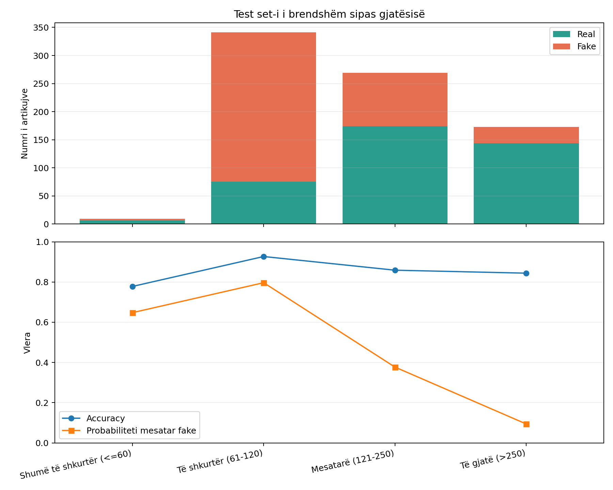
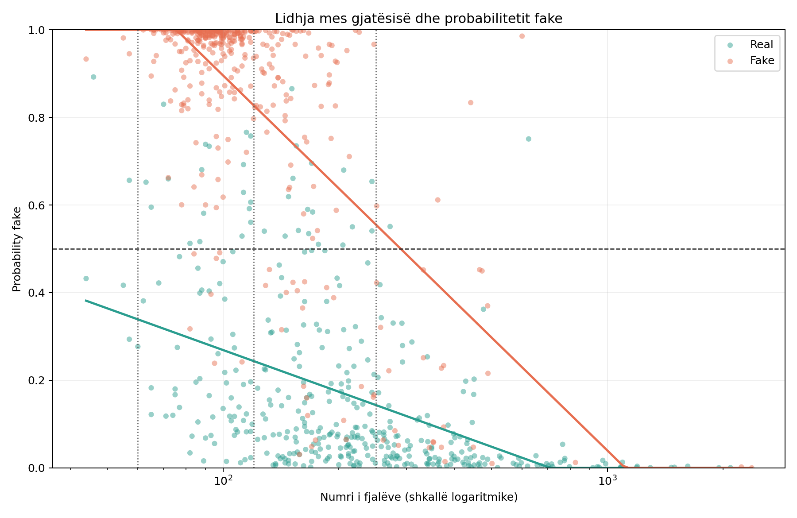
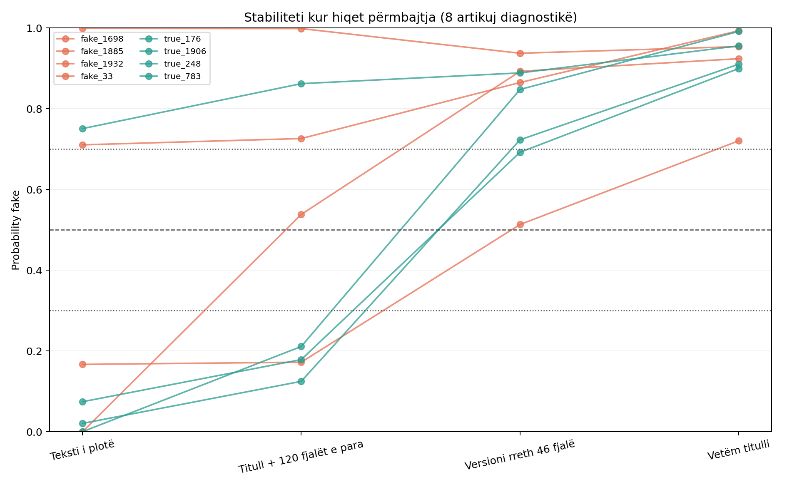
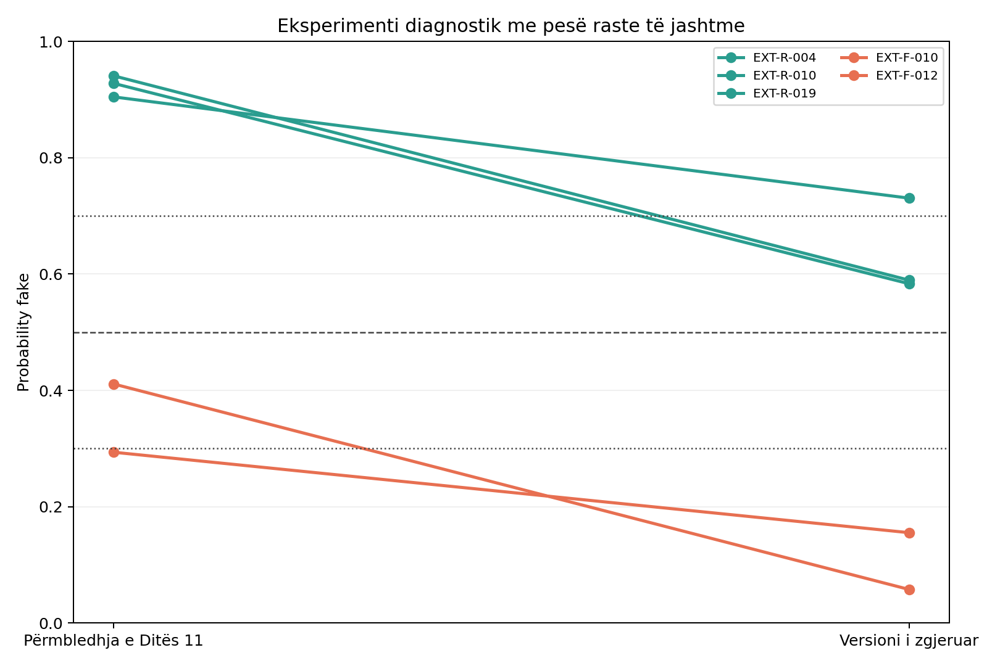
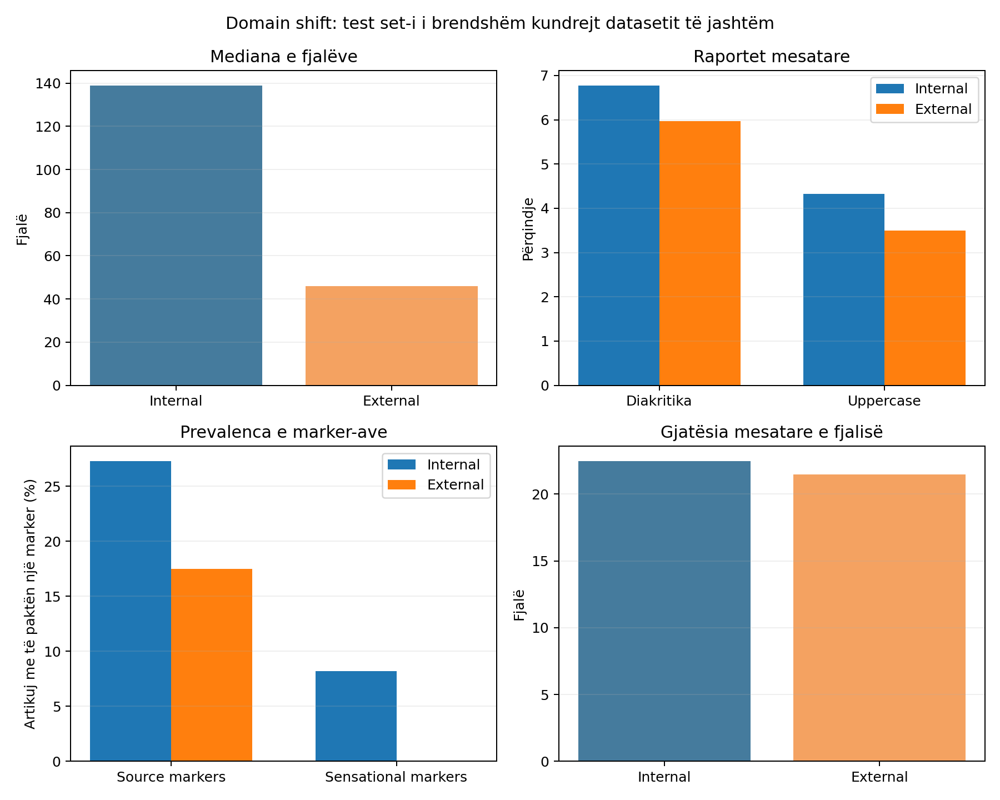

# Dita 12 - Analiza e gjatësisë dhe domain shift-it

## Integriteti i eksperimentit

Analiza përdori modelin ekzistues `calibrated_tfidf_logreg.joblib`, të njëjtin
preprocessing dhe pragjet e pandryshuara 0.30/0.70. Nuk u thirr `fit`, nuk u
ruajt model i ri dhe `data/external/external_news.csv` nuk u ndryshua. Hash-et e
modelit, datasetit të jashtëm dhe të gjitha output-eve të Ditës 11 u kontrolluan
para dhe pas analizës: **Po**.

Test set-i i brendshëm përmban 792 artikuj pas
përjashtimit të 7 dublikatave ekzakte me
train set-in.

## Performanca e brendshme sipas gjatësisë

Intervalet janë fikse dhe të interpretueshme; ato nuk u zgjodhën për të
optimizuar metrikat.

| length_description | rows | real_rows | fake_rows | accuracy | false_positives | false_negatives | mean_probability_fake | likely_real | uncertain | likely_fake |
| --- | --- | --- | --- | --- | --- | --- | --- | --- | --- | --- |
| Shumë të shkurtër (<=60) | 9 | 6 | 3 | 0.7778 | 2 | 0 | 0.6475 | 2 | 3 | 4 |
| Të shkurtër (61-120) | 341 | 75 | 266 | 0.9267 | 18 | 7 | 0.7965 | 47 | 39 | 255 |
| Mesatarë (121-250) | 269 | 174 | 95 | 0.8587 | 17 | 21 | 0.3769 | 147 | 54 | 68 |
| Të gjatë (>250) | 173 | 144 | 29 | 0.8439 | 2 | 25 | 0.0940 | 156 | 14 | 3 |

Vetëm 9 artikuj të brendshëm kishin deri në 60 fjalë,
ndërsa grupi 61-120 dominohej nga fake. Probabiliteti mesatar fake ra nga
64.75% në grupin shumë të
shkurtër në 9.40% te artikujt
mbi 250 fjalë. Kjo përzierje e label-it me gjatësinë është një sinjal i fortë
se modeli ka mësuar edhe dallime të corpus-it, jo vetëm dallime të përgjithshme
mes lajmeve real dhe fake.



## Krahasimi me gjatësi të përafërt

| cohort | rows | real_rows | fake_rows | accuracy | false_positives | false_negatives | mean_probability_fake_real | mean_probability_fake_fake | predicted_fake_rate |
| --- | --- | --- | --- | --- | --- | --- | --- | --- | --- |
| internal_30_60 | 9 | 6 | 3 | 0.7778 | 2 | 0 | 0.4947 | 0.9532 | 0.5556 |
| internal_external_range_38_51 | 3 | 2 | 1 | 0.6667 | 1 | 0 | 0.6622 | 0.9332 | 0.6667 |
| external_day11_38_51 | 40 | 20 | 20 | 0.4750 | 19 | 2 | 0.7474 | 0.8167 | 0.9250 |

Cohort-i i brendshëm 30-60 fjalë ka vetëm 9 raste,
prandaj nuk jep një vlerësim të qëndrueshëm. Megjithatë, ai arriti
77.78% accuracy dhe gaboi
2 nga
6 rastet real. Dataset-i i jashtëm gaboi
19 nga
20 rastet real. Pra shkurtësia rrit prirjen
drejt fake, por **nuk e riprodhon e vetme dështimin 19/20** të jashtëm.

Intervali ekzakt 38-51 fjalë ka vetëm
3 raste të
brendshme, ndaj përdoret vetëm si kontroll përshkrues.

## Ndikimi veçmas për real dhe fake

| label | length_description | rows | accuracy | mean_probability_fake | predicted_fake_rate | likely_real | uncertain | likely_fake |
| --- | --- | --- | --- | --- | --- | --- | --- | --- |
| real | Shumë të shkurtër (<=60) | 6 | 0.6667 | 0.4947 | 0.3333 | 2 | 3 | 1 |
| real | Të shkurtër (61-120) | 75 | 0.7600 | 0.3000 | 0.2400 | 45 | 25 | 5 |
| real | Mesatarë (121-250) | 174 | 0.9023 | 0.1776 | 0.0977 | 136 | 36 | 2 |
| real | Të gjatë (>250) | 144 | 0.9861 | 0.0627 | 0.0139 | 137 | 6 | 1 |
| fake | Shumë të shkurtër (<=60) | 3 | 1.0000 | 0.9532 | 1.0000 | 0 | 0 | 3 |
| fake | Të shkurtër (61-120) | 266 | 0.9737 | 0.9365 | 0.9737 | 2 | 14 | 250 |
| fake | Mesatarë (121-250) | 95 | 0.7789 | 0.7420 | 0.7789 | 11 | 18 | 66 |
| fake | Të gjatë (>250) | 29 | 0.1379 | 0.2495 | 0.1379 | 19 | 8 | 2 |

- Për real, probability fake mesatare ishte
  49.47% deri në 60 fjalë
  dhe 6.27% mbi 250 fjalë.
- Për fake, probability fake mesatare ishte
  95.32% deri në 60 fjalë,
  por vetëm 24.95% mbi 250 fjalë.
- Accuracy për fake të gjatë ishte 13.79%;
  kjo tregon problemin simetrik: fake të gjatë shtyhen drejt real.

| scope | rows | spearman_rho | spearman_p_value | pearson_r |
| --- | --- | --- | --- | --- |
| all | 792 | -0.7132 | 5.18e-124 | -0.4589 |
| real | 399 | -0.5883 | 1.61e-38 | -0.3476 |
| fake | 393 | -0.4971 | 6.49e-26 | -0.4977 |

Spearman rho ishte -0.7132 në total,
-0.5883 vetëm te real dhe
-0.4971 vetëm te fake. Lidhja
negative mbetet brenda secilës klasë, ndaj nuk shpjegohet vetëm nga përzierja e
label-eve. Kjo është lidhje statistikore dhe jo provë e vetme shkakësie.



## Eksperimenti i stabilitetit të brendshëm

U përzgjodhën katër artikuj për secilën klasë, me të paktën 180 fjalë dhe në
pozicione të ndryshme të shpërndarjes së probability fake. Ky është kampion
diagnostik, jo metrikë e re testimi. Corpus-i i përpunuar nuk ruan kufij
paragrafësh; prandaj `title_plus_first_paragraph_proxy` është operacionalizuar
si titulli plus deri në 120 fjalët e para.

| variant_description | true_label | rows | mean_word_count | mean_probability_fake | mean_delta_probability_fake_from_full | binary_accuracy | binary_changes_from_full | decision_changes_from_full |
| --- | --- | --- | --- | --- | --- | --- | --- | --- |
| Teksti i plotë | fake | 4 | 764.2500 | 0.4691 | 0.0000 | 0.5000 | 0 | 0 |
| Titull + 120 fjalët e para | fake | 4 | 120.0000 | 0.6088 | 0.1397 | 0.7500 | 1 | 1 |
| Versioni rreth 46 fjalë | fake | 4 | 46.2500 | 0.8021 | 0.3329 | 1.0000 | 2 | 2 |
| Vetëm titulli | fake | 4 | 15.5000 | 0.8979 | 0.4287 | 1.0000 | 2 | 2 |
| Teksti i plotë | real | 4 | 770.2500 | 0.2115 | 0.0000 | 0.7500 | 0 | 0 |
| Titull + 120 fjalët e para | real | 4 | 120.5000 | 0.3443 | 0.1327 | 0.7500 | 0 | 0 |
| Versioni rreth 46 fjalë | real | 4 | 46.0000 | 0.7879 | 0.5764 | 0.0000 | 3 | 3 |
| Vetëm titulli | real | 4 | 11.2500 | 0.9393 | 0.7278 | 0.0000 | 3 | 3 |

Në 7 nga 8 rastet, versioni rreth
46 fjalë mori probability fake më të lartë se teksti i plotë. Ndryshimet binare
dhe të vendimit raportohen për çdo variant në CSV. Heqja e përmbajtjes ndryshon
edhe fjalorin dhe peshat TF-IDF, prandaj eksperimenti tregon ndjeshmëri ndaj
shkurtimit, jo një efekt të izoluar mekanik të numrit të fjalëve.



## Eksperimenti diagnostik me raste të jashtme

Pesë raste problematike të Ditës 11 u zgjeruan vetëm me informacion nga URL-ja
e tyre burimore: tri real me gabim të fortë dhe dy fake të humbura. Tekstet u
ruajtën veçmas te `data/interim/day12_external_expansions.csv`. Verdikti,
përgënjeshtrimi dhe provat e fact-check-ut nuk iu dhanë modelit. Ky eksperiment
nuk ndryshon benchmark-un dhe nuk llogaritet si rezultat i ri i jashtëm.

| external_id | true_label | short_word_count | expanded_word_count | short_probability_fake | expanded_probability_fake | delta_probability_fake | short_decision | expanded_decision |
| --- | --- | --- | --- | --- | --- | --- | --- | --- |
| EXT-R-004 | real | 49 | 123 | 0.9047 | 0.7305 | -0.1742 | likely_fake | likely_fake |
| EXT-R-010 | real | 41 | 118 | 0.9410 | 0.5894 | -0.3516 | likely_fake | uncertain |
| EXT-R-019 | real | 41 | 119 | 0.9280 | 0.5833 | -0.3447 | likely_fake | uncertain |
| EXT-F-010 | fake | 51 | 116 | 0.2937 | 0.1553 | -0.1384 | likely_real | likely_real |
| EXT-F-012 | fake | 50 | 126 | 0.4111 | 0.0576 | -0.3535 | uncertain | likely_real |

Për tri rastet real, ndryshimi mesatar i probability fake ishte
-0.2902; për dy rastet fake ishte
-0.2460. Në
5 nga 5 rastet, zgjerimi e uli probability
fake dhe ndryshoi 3 vendime. Kjo ndihmoi dy raste
real të kalonin nga `likely_fake` në `uncertain`, por e shtyu edhe
`EXT-F-012` nga `uncertain` në `likely_real`. Pra drejtimi lidhet me zgjerimin,
jo me saktësinë e label-it. Me vetëm pesë raste dhe me zgjerime të kuruara
manualisht, rezultati përdoret si kontroll stabiliteti, jo si provë
përfundimtare.



## Domain shift përtej gjatësisë

| dataset | rows | mean_word_count | median_word_count | mean_avg_sentence_length | mean_diacritic_ratio | mean_uppercase_ratio | source_marker_prevalence | sensational_marker_prevalence |
| --- | --- | --- | --- | --- | --- | --- | --- | --- |
| internal_test | 792 | 210.4583 | 139.0000 | 22.4499 | 0.0678 | 0.0433 | 0.2727 | 0.0821 |
| external_day10 | 40 | 45.5750 | 46.0000 | 21.4632 | 0.0596 | 0.0349 | 0.1750 | 0.0000 |

Ndryshimet e dokumentuara janë:

- **Periudha:** corpus-i i brendshëm mbulon
  2020-04-27 deri
  2020-07-29; rastet e jashtme
  2024-07-30 deri
  2026-07-31.
- **Stili:** të brendshmet janë artikuj corpus-i, ndërsa të jashtmet janë
  përmbledhje manuale uniforme. Kjo ndryshon fjalorin, strukturën dhe dendësinë
  e informacionit.
- **Temat:** dataset-i i jashtëm ka pesë tema të balancuara me dorë
  (ekonomi, politikë, shëndetësi, sociale, teknologji). Corpus-i i brendshëm nuk ka label
  teme, prandaj diferenca tematike nuk mund të matet drejt.
- **Burimet:** në datasetin e jashtëm, real vijnë nga burime institucionale dhe
  fake nga pretendime sociale të dokumentuara nga fact-check. Burimi nuk i
  jepet modelit, por kjo ndërthurje pengon ndarjen e efektit të stilit nga label-i.
- **Forma gjuhësore:** diakritikat, uppercase ratio, source markers dhe
  sensational markers kanë shpërndarje të ndryshme në tabelë. Këto janë
  kandidatë për domain shift, jo prova shkakësie.



## Përfundimi

Bias-i i lidhur me gjatësinë është **i fortë**. Ai shfaqet në grupet e
brendshme, në të dyja klasat, në korrelacionet negative dhe në eksperimentin e
shkurtimit. Modeli TF-IDF nuk merr `word_count` si kolonë numerike; sinjali vjen
në mënyrë indirekte nga fjalori, sasia e kontekstit dhe shpërndarja e gjatësisë
në corpus.

Gjatësia shpjegon një pjesë të rëndësishme, por **jo pjesën e plotë të dështimit
të jashtëm**. Lajmet real të brendshme me 30-60 fjalë nuk u sollën aq keq sa 20
lajmet real të jashtme. Periudha e re, përmbledhja manuale, temat, burimet dhe
ndryshimet në marker-at gjuhësorë tregojnë domain shift shtesë.

Modeli aktual mund të ruhet si baseline dhe si pjesë e analizës së diplomës,
por jo të konsiderohet detektor i besueshëm për përmbledhje të shkurtra jashtë
corpus-it. Rezultatet e dobëta nuk duhen fshehur; ato janë një gjetje e vlefshme
mbi kufijtë e përgjithësimit.

## Rekomandimi për Ditën 13

Të krahasohen në të njëjtën ndarje pa leakage:

1. Word TF-IDF;
2. Character TF-IDF;
3. Word + Character TF-IDF.

Krahasimi duhet të ruajë modelin dhe benchmark-un aktual, të raportojë veçmas
test set-in e brendshëm, cohort-in 30-60 fjalë dhe datasetin e jashtëm. Dataset-i
i jashtëm nuk duhet përdorur për tuning ose zgjedhje pragjesh.

## Output-et

```text
reports/day12_internal_predictions.csv
reports/day12_internal_length_groups.csv
reports/day12_label_length_summary.csv
reports/day12_internal_30_60_cases.csv
reports/day12_matched_length_comparison.csv
reports/day12_length_correlations.csv
reports/day12_internal_stability_experiment.csv
reports/day12_internal_stability_summary.csv
reports/day12_external_expansion_experiment.csv
reports/day12_domain_shift_summary.csv
reports/day12_metrics.json
reports/day12_length_domain_shift.md
reports/figures/day12_*.png
```
