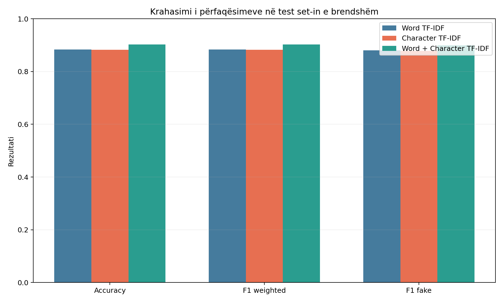
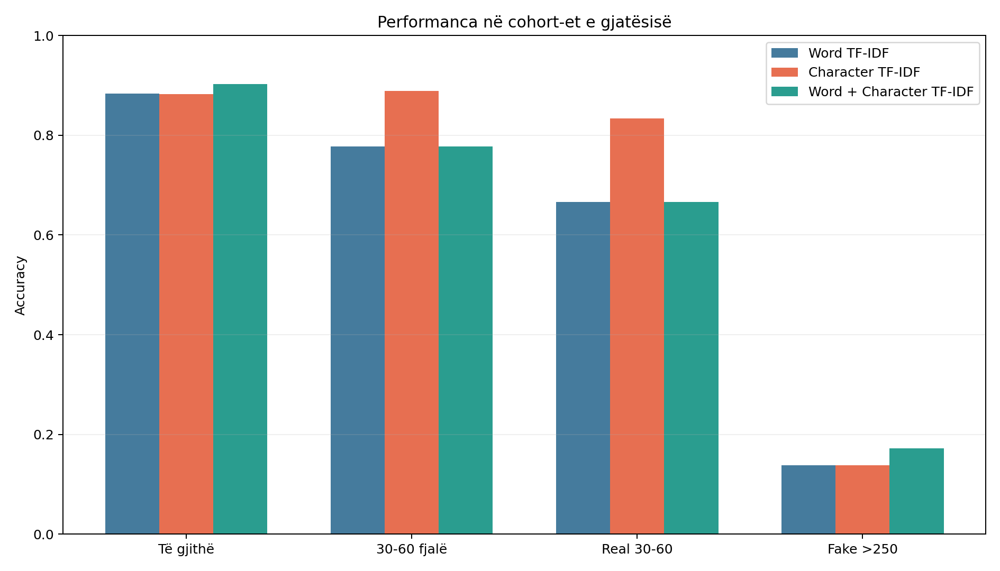
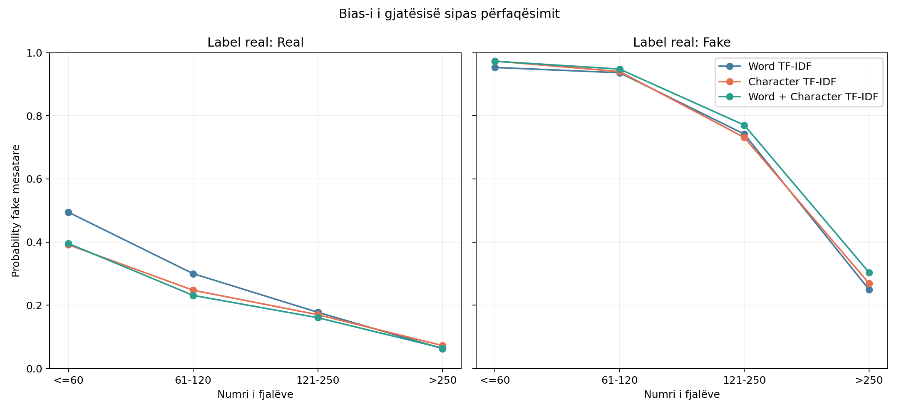
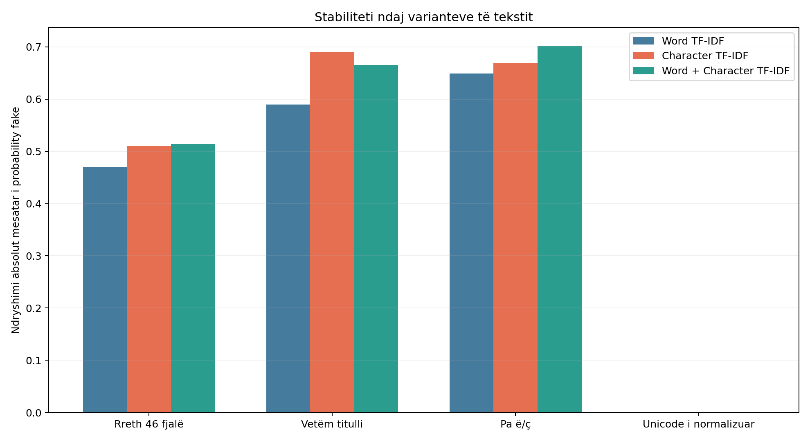
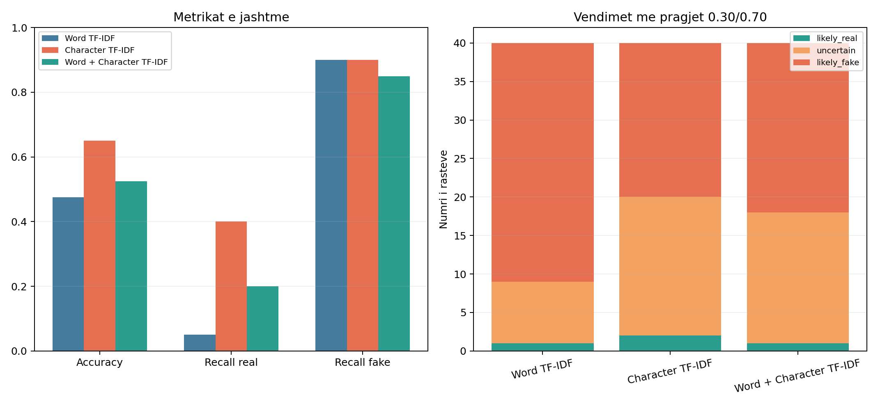

# Dita 13 - Krahasimi i përfaqësimeve TF-IDF

## Protokolli

U përdorën të njëjtat `train.csv`/`test.csv`, preprocessing bazë dhe përjashtimi
i 7 dublikatave ekzakte train/test. Të tre variantet përdorën të njëjtën
`LogisticRegression(max_iter=1000, class_weight='balanced')` dhe sigmoid
calibration me 5 fold-e group-safe. Pragjet mbetën 0.30/0.70.

Dataset-i i jashtëm nuk u lexua gjatë character screen, trajnimit, vlerësimit
të brendshëm ose përzgjedhjes. Përzgjedhja u ruajt fillimisht te
`reports/day13_internal_selection.json`; vetëm pas kësaj u hap benchmark-u i
jashtëm. Modeli aktual i aplikacionit dhe dataset-i i jashtëm mbetën të
pandryshuar.

## Character screen vetëm mbi train

U provuan vetëm dy konfigurime të paracaktuara, jo një grid search i madh.

| config_name | ngram_min | ngram_max | max_features | mean_accuracy | mean_f1_weighted | mean_f1_fake | training_seconds |
| --- | --- | --- | --- | --- | --- | --- | --- |
| char_wb_3_5 | 3 | 5 | 50000 | 0.8836 | 0.8833 | 0.8783 | 30.1070 |
| char_wb_3_6 | 3 | 6 | 60000 | 0.8817 | 0.8814 | 0.8757 | 38.4370 |

U zgjodh `char_wb_3_5` sipas F1 weighted
mesatare në 3-fold group-safe CV. I njëjti konfigurim u përdor te Character dhe
Word + Character.

## Rezultatet e brendshme

| model_display | accuracy | precision_weighted | recall_weighted | f1_weighted | f1_fake | false_positives | false_negatives | brier_score | log_loss | training_seconds | model_size_mb |
| --- | --- | --- | --- | --- | --- | --- | --- | --- | --- | --- | --- |
| Word TF-IDF | 0.8838 | 0.8843 | 0.8838 | 0.8838 | 0.8808 | 39 | 53 | 0.0809 | 0.2816 | 19.0590 | 0.5670 |
| Character TF-IDF | 0.8826 | 0.8838 | 0.8826 | 0.8825 | 0.8781 | 35 | 58 | 0.0792 | 0.2715 | 64.0020 | 0.8120 |
| Word + Character TF-IDF | 0.9028 | 0.9035 | 0.9028 | 0.9027 | 0.8999 | 30 | 47 | 0.0713 | 0.2482 | 87.6510 | 1.3540 |

Confusion matrices në rendin `[real, fake]`:

- Word: `[[360, 39], [53, 340]]`;
- Character: `[[364, 35], [58, 335]]`;
- Word + Character: `[[369, 30], [47, 346]]`.

Sipas rregullit të ngrirë, varianti më i mirë i brendshëm ishte
**Word + Character TF-IDF** me F1 weighted
90.27%. Përzgjedhja
nuk varet nga rezultatet e jashtme.



## Cohort-et problematike

| model_display | cohort | rows | accuracy | f1_weighted | recall_real | recall_fake | mean_probability_fake_real | mean_probability_fake_fake |
| --- | --- | --- | --- | --- | --- | --- | --- | --- |
| Word TF-IDF | internal_30_60 | 9 | 0.7778 | 0.7833 | 0.6667 | 1.0000 | 0.4947 | 0.9532 |
| Word TF-IDF | short_real_30_60 | 6 | 0.6667 | 0.8000 | 0.6667 | 0.0000 | 0.4947 | n/a |
| Word TF-IDF | long_fake_gt_250 | 29 | 0.1379 | 0.2424 | 0.0000 | 0.1379 | n/a | 0.2495 |
| Character TF-IDF | internal_30_60 | 9 | 0.8889 | 0.8918 | 0.8333 | 1.0000 | 0.3916 | 0.9733 |
| Character TF-IDF | short_real_30_60 | 6 | 0.8333 | 0.9091 | 0.8333 | 0.0000 | 0.3916 | n/a |
| Character TF-IDF | long_fake_gt_250 | 29 | 0.1379 | 0.2424 | 0.0000 | 0.1379 | n/a | 0.2692 |
| Word + Character TF-IDF | internal_30_60 | 9 | 0.7778 | 0.7833 | 0.6667 | 1.0000 | 0.3956 | 0.9730 |
| Word + Character TF-IDF | short_real_30_60 | 6 | 0.6667 | 0.8000 | 0.6667 | 0.0000 | 0.3956 | n/a |
| Word + Character TF-IDF | long_fake_gt_250 | 29 | 0.1724 | 0.2941 | 0.0000 | 0.1724 | n/a | 0.3038 |

Cohort-i 30-60 ka vetëm 9 raste, prej të cilave 6 real. Fake mbi 250 fjalë ka
29 raste. Këto rezultate janë diagnostike dhe duhen interpretuar bashkë me
madhësinë e kampionit. Varianti me renditjen më të mirë për cohort-in e shkurtër
ishte **Character TF-IDF**.



## Bias-i i gjatësisë

| model_display | spearman_all | spearman_real | spearman_fake | real_probability_gap_short_minus_long | fake_probability_gap_short_minus_long | short_real_accuracy | long_fake_accuracy |
| --- | --- | --- | --- | --- | --- | --- | --- |
| Word TF-IDF | -0.7132 | -0.5883 | -0.4971 | 0.4320 | 0.7037 | 0.6667 | 0.1379 |
| Character TF-IDF | -0.6887 | -0.4701 | -0.5424 | 0.3195 | 0.7041 | 0.8333 | 0.1379 |
| Word + Character TF-IDF | -0.6816 | -0.4820 | -0.5067 | 0.3315 | 0.6692 | 0.6667 | 0.1724 |

Vlera më afër zeros për lidhjen mes gjatësisë dhe probability fake u arrit nga
**Word + Character TF-IDF**. Për krahasim, hendeku real short-minus-long
ishte 0.4320
te Word, 0.3195
te Character dhe
0.3315
te kombinimi. Character n-grams
e ulën
lidhjen e gjatësisë te lajmet real krahasuar me Word TF-IDF.



## Stabiliteti i tekstit

U ripërdorën të njëjtat 8 raste të brendshme të Ditës 12. Varianti Unicode u
krijua fillimisht në NFD dhe kaloi në të njëjtin NFC preprocessing; prandaj
duhet të japë rezultat identik me tekstin e plotë.

| model_display | variant_description | mean_absolute_delta_from_full | max_absolute_delta_from_full | binary_changes_from_full | decision_changes_from_full |
| --- | --- | --- | --- | --- | --- |
| Word TF-IDF | Rreth 46 fjalë | 0.4701 | 0.8927 | 5 | 5 |
| Character TF-IDF | Rreth 46 fjalë | 0.5110 | 0.7247 | 7 | 7 |
| Word + Character TF-IDF | Rreth 46 fjalë | 0.5141 | 0.8274 | 6 | 7 |
| Word TF-IDF | Vetëm titulli | 0.5895 | 0.9912 | 5 | 5 |
| Character TF-IDF | Vetëm titulli | 0.6901 | 0.9815 | 7 | 7 |
| Word + Character TF-IDF | Vetëm titulli | 0.6658 | 0.9852 | 6 | 7 |
| Word TF-IDF | Pa ë/ç | 0.6489 | 0.9977 | 5 | 5 |
| Character TF-IDF | Pa ë/ç | 0.6696 | 0.9570 | 7 | 7 |
| Word + Character TF-IDF | Pa ë/ç | 0.7021 | 0.9936 | 6 | 7 |
| Word TF-IDF | Unicode i normalizuar | 0.0000 | 0.0000 | 0 | 0 |
| Character TF-IDF | Unicode i normalizuar | 0.0000 | 0.0000 | 0 | 0 |
| Word + Character TF-IDF | Unicode i normalizuar | 0.0000 | 0.0000 | 0 | 0 |

Për versionin 46 fjalë, ndryshimi absolut mesatar ishte
0.4701
te Word,
0.5110
te Character dhe
0.5141
te kombinimi. Për Unicode të normalizuar, ndryshimi maksimal ishte
0.00000000.

Character arriti accuracy më të mirë në 9 tekstet natyrshëm 30-60 fjalë, por
ndryshimi i tij mesatar pas shkurtimit artificial ishte më i madh se te Word.
Pra character n-grams nuk dhanë stabilitet uniform. Heqja e `ë/ç` shkaktoi
ndryshime të mëdha te të tre modelet, ndërsa normalizimi Unicode ishte plotësisht
stabil.



## Vlerësimi i jashtëm vetëm diagnostik

Këto rezultate u llogaritën pasi përzgjedhja e brendshme ishte shkruar dhe
hash-i i saj ishte ngrirë. Ato nuk ndryshuan konfigurimet ose rekomandimin.

| model_display | accuracy | recall_real | recall_fake | false_positives | false_negatives | likely_real | uncertain | likely_fake | mean_probability_fake_real | mean_probability_fake_fake |
| --- | --- | --- | --- | --- | --- | --- | --- | --- | --- | --- |
| Word TF-IDF | 0.4750 | 0.0500 | 0.9000 | 19 | 2 | 1 | 8 | 31 | 0.7474 | 0.8167 |
| Character TF-IDF | 0.6500 | 0.4000 | 0.9000 | 12 | 2 | 2 | 18 | 20 | 0.5525 | 0.7953 |
| Word + Character TF-IDF | 0.5250 | 0.2000 | 0.8500 | 16 | 3 | 1 | 17 | 22 | 0.6263 | 0.7892 |

Confusion matrices:

- Word: `[[1, 19], [2, 18]]`;
- Character: `[[8, 12], [2, 18]]`;
- Word + Character: `[[4, 16], [3, 17]]`.

Character ndryshoi accuracy e jashtme me
+17.50 pikë përqindjeje dhe kombinimi me
+5.00 pikë përqindjeje kundrejt Word.
Character-only ishte më i miri në këtë benchmark, ndërsa kombinimi dha vetëm
përmirësim të pjesshëm të generalizimit. Ky është vetëm vëzhgim diagnostik dhe
nuk përdoret për model selection.



## Përfundimi

- Varianti më i mirë në vlerësimin e brendshëm ishte
  **Word + Character TF-IDF**.
- Varianti më i mirë në cohort-in 30-60 ishte **Character TF-IDF**.
- Lidhjen më të ulët me gjatësinë e pati **Word + Character TF-IDF**.
- Character n-grams
  nuk e përmirësuan
  F1 weighted kundrejt Word baseline.
- Character uli bias-in te real të shkurtër, por jo te fake të gjatë dhe nuk
  ishte më stabil ndaj çdo transformimi diagnostik.
- Word + Character
  e përmirësoi
  rezultatin e brendshëm kundrejt Word baseline.
- Jashtë corpus-it, Character-only përgjithësoi më mirë se kombinimi; ky rezultat
  nuk ndryshon rekomandimin e ngrirë nga vlerësimi i brendshëm.

Për Ditën 14 rekomandohet **Word + Character TF-IDF**
si përfaqësim i ngrirë për krahasimin e classifier-ëve. Modelet e tjera ruhen si
eksperimente dhe asnjëri nuk integrohet ende në Streamlit.

## Kufizimet

- Character screen kishte vetëm dy konfigurime dhe u bë vetëm mbi train.
- Cohort-i 30-60 ka 9 raste dhe nuk jep interval të ngushtë besimi.
- Stabiliteti përdor 8 raste të zgjedhura diagnostike, jo gjithë test set-in.
- Të tre modelet mësojnë nga i njëjti corpus ku gjatësia dhe label-i janë të
  lidhura; përfaqësimi i ri nuk e heq automatikisht këtë bias.
- Dataset-i i jashtëm ka përmbledhje manuale dhe source-label confounding;
  rezultatet e tij nuk janë tuning set.
- Përzgjedhja e classifier-it në Ditën 14 duhet bërë me CV mbi train, duke
  ruajtur test set-in dhe benchmark-un e jashtëm për vlerësim.

## Modelet eksperimentale

```text
models/day13_word_tfidf_logreg_calibrated.joblib
models/day13_char_tfidf_logreg_calibrated.joblib
models/day13_word_char_tfidf_logreg_calibrated.joblib
```

Modeli i aplikacionit `models/calibrated_tfidf_logreg.joblib` nuk u zëvendësua.
