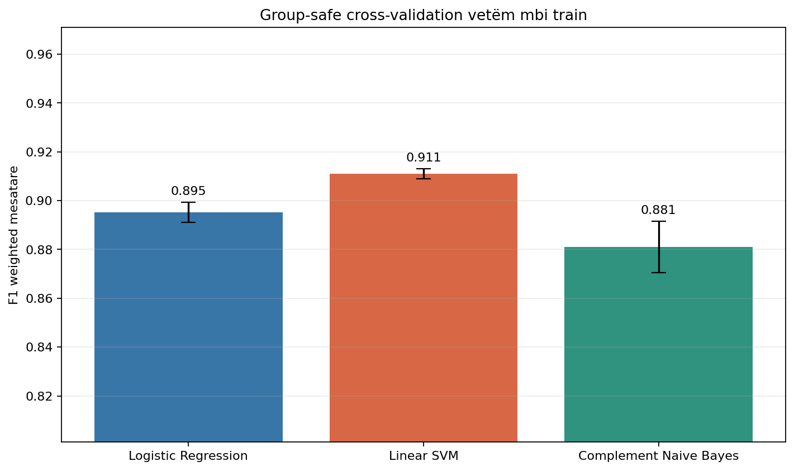
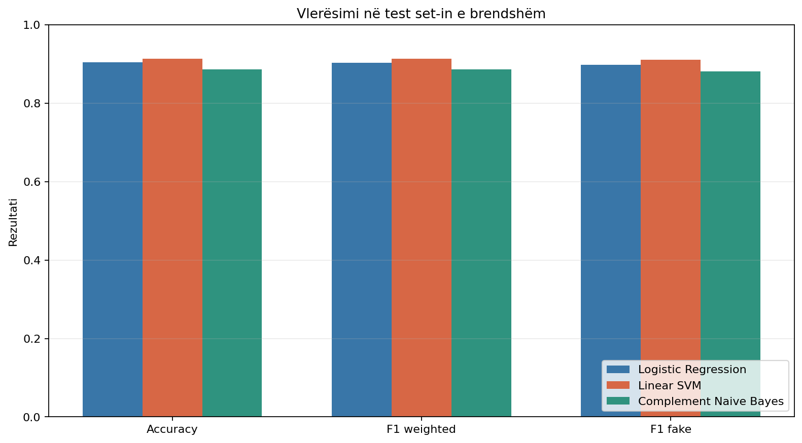
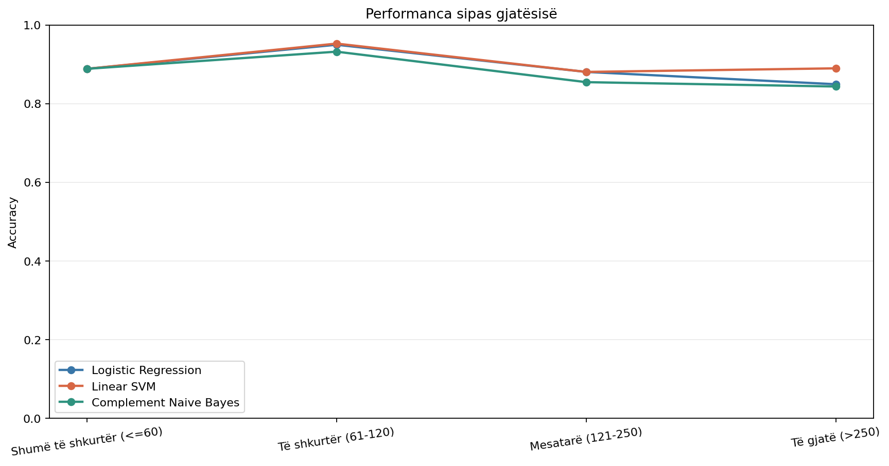
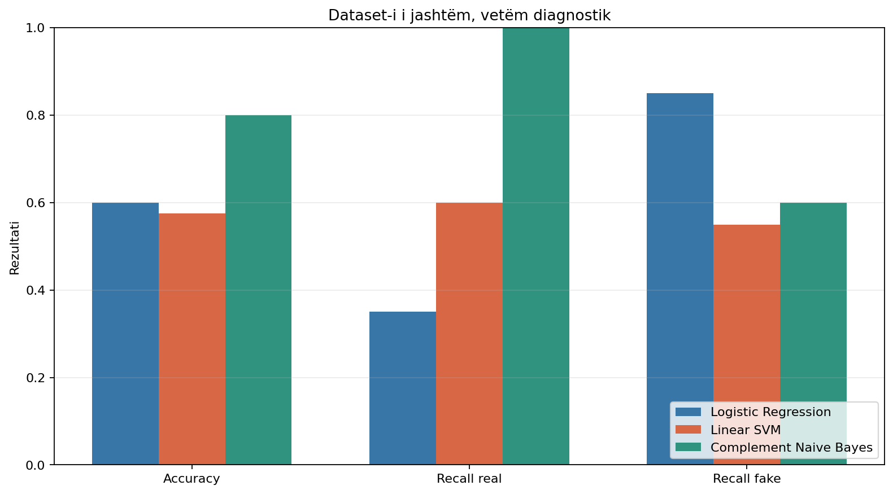

# Dita 14 - Krahasimi i classifier-ëve

## Protokolli

Përfaqësimi u mbajt fiks si në Ditën 13: Word TF-IDF `(1, 2)`, maksimumi
30,000 features, plus Character TF-IDF `char_wb (3, 5)`, maksimumi 50,000
features. U përdor i njëjti preprocessing bazë dhe asnjë classifier nuk u
kalibrua.

Përzgjedhja u bë vetëm mbi 3195 artikujt train
me 5-fold `StratifiedGroupKFold`. `pair_id` i njëjtë dhe tekstet identike u
mbajtën në të njëjtin leakage-group; u gjetën
1586 grupe dhe zero mbivendosje mes fit dhe
validation. Për shkak të normalizimit aktual NFC, u rindërtuan vetëm në memorie
21 vlera
`model_text`; CSV-të nuk u ndryshuan.

Zgjedhja u shkrua te `reports/day14_selection.json` përpara se të ngarkohej
test set-i i brendshëm. Dataset-i i jashtëm u hap vetëm pas kësaj. Test-i,
benchmark-u i jashtëm dhe modeli aktual i Streamlit nuk u përdorën për tuning.

## Konfigurimet e provuara

U provuan dy vlera të arsyeshme për secilën familje: Logistic Regression dhe
Linear SVM me `C=0.5/1.0`, si dhe Complement Naive Bayes me `alpha=0.5/1.0`.
TF-IDF u përshtat një herë për çdo fold dhe u nda mes kandidatëve; koha e
trajnimit në tabelë përfshin atë kosto të përbashkët plus fit-in e classifier-it.

## Cross-validation vetëm mbi train

| classifier_display | parameter_name | parameter_value | mean_accuracy | mean_precision_weighted | mean_recall_weighted | mean_f1_weighted | std_f1_weighted | mean_f1_fake | mean_recall_real | mean_recall_fake | mean_training_seconds |
| --- | --- | --- | --- | --- | --- | --- | --- | --- | --- | --- | --- |
| Logistic Regression | C | 1.0000 | 0.8955 | 0.8993 | 0.8955 | 0.8952 | 0.0041 | 0.8901 | 0.9437 | 0.8472 | 11.1597 |
| Linear SVM | C | 1.0000 | 0.9111 | 0.9135 | 0.9111 | 0.9110 | 0.0021 | 0.9076 | 0.9487 | 0.8735 | 11.4136 |
| Complement Naive Bayes | alpha | 0.5000 | 0.8814 | 0.8860 | 0.8814 | 0.8810 | 0.0106 | 0.8745 | 0.9356 | 0.8272 | 10.7770 |

Rregulli kryesor ishte F1 weighted mesatare. Kandidatët brenda 0.002 nga vlera
më e mirë u renditën sipas devijimit standard më të ulët, pastaj F1 fake dhe
përshtatshmërisë për calibration/deploy. Fituesi i ngrirë ishte
**Linear SVM** (`linear_svm_c_1_0`), me
F1 weighted 0.9110 ±
0.0021.

Classifier-i më i qëndrueshëm sipas devijimit standard ishte
**Linear SVM**, ndërsa hendekun më të vogël mes recall real
dhe fake e pati **Linear SVM**. Këto përfundime përdorin
vetëm train/CV.



## Test set-i i brendshëm

Pas ngrirjes së përzgjedhjes u përjashtuan
7 dublikatat ekzakte
train/test dhe mbetën 792 artikuj.

| classifier_display | accuracy | f1_weighted | f1_fake | recall_real | recall_fake | false_positives | false_negatives | confusion_matrix |
| --- | --- | --- | --- | --- | --- | --- | --- | --- |
| Logistic Regression | 0.9040 | 0.9038 | 0.8981 | 0.9549 | 0.8524 | 18 | 58 | [[381, 18], [58, 335]] |
| Linear SVM | 0.9141 | 0.9141 | 0.9112 | 0.9398 | 0.8880 | 24 | 44 | [[375, 24], [44, 349]] |
| Complement Naive Bayes | 0.8864 | 0.8862 | 0.8813 | 0.9223 | 0.8499 | 31 | 59 | [[368, 31], [59, 334]] |

Kandidati i zgjedhur arriti accuracy 0.9141, F1
weighted 0.9141 dhe F1 fake
0.9112. Ky rezultat nuk u përdor për të ndryshuar
zgjedhjen.



## Grupet e gjatësisë

| classifier_display | length_description | rows | accuracy | f1_weighted | recall_real | recall_fake |
| --- | --- | --- | --- | --- | --- | --- |
| Logistic Regression | Shumë të shkurtër (<=60) | 9 | 0.8889 | 0.8918 | 0.8333 | 1.0000 |
| Logistic Regression | Të shkurtër (61-120) | 341 | 0.9501 | 0.9503 | 0.8933 | 0.9662 |
| Logistic Regression | Mesatarë (121-250) | 269 | 0.8810 | 0.8786 | 0.9483 | 0.7579 |
| Logistic Regression | Të gjatë (>250) | 173 | 0.8497 | 0.7949 | 1.0000 | 0.1034 |
| Linear SVM | Shumë të shkurtër (<=60) | 9 | 0.8889 | 0.8918 | 0.8333 | 1.0000 |
| Linear SVM | Të shkurtër (61-120) | 341 | 0.9531 | 0.9533 | 0.9067 | 0.9662 |
| Linear SVM | Mesatarë (121-250) | 269 | 0.8810 | 0.8801 | 0.9253 | 0.8000 |
| Linear SVM | Të gjatë (>250) | 173 | 0.8902 | 0.8767 | 0.9792 | 0.4483 |
| Complement Naive Bayes | Shumë të shkurtër (<=60) | 9 | 0.8889 | 0.8918 | 0.8333 | 1.0000 |
| Complement Naive Bayes | Të shkurtër (61-120) | 341 | 0.9326 | 0.9321 | 0.8267 | 0.9624 |
| Complement Naive Bayes | Mesatarë (121-250) | 269 | 0.8550 | 0.8532 | 0.9138 | 0.7474 |
| Complement Naive Bayes | Të gjatë (>250) | 173 | 0.8439 | 0.7984 | 0.9861 | 0.1379 |

Dy cohort-et e kërkuara:

| classifier_display | cohort | rows | accuracy | recall_real | recall_fake | confusion_matrix |
| --- | --- | --- | --- | --- | --- | --- |
| Logistic Regression | real_30_60 | 6 | 0.8333 | 0.8333 | 0.0000 | [[5, 1], [0, 0]] |
| Logistic Regression | fake_gt_250 | 29 | 0.1034 | 0.0000 | 0.1034 | [[0, 0], [26, 3]] |
| Linear SVM | real_30_60 | 6 | 0.8333 | 0.8333 | 0.0000 | [[5, 1], [0, 0]] |
| Linear SVM | fake_gt_250 | 29 | 0.4483 | 0.0000 | 0.4483 | [[0, 0], [16, 13]] |
| Complement Naive Bayes | real_30_60 | 6 | 0.8333 | 0.8333 | 0.0000 | [[5, 1], [0, 0]] |
| Complement Naive Bayes | fake_gt_250 | 29 | 0.1379 | 0.0000 | 0.1379 | [[0, 0], [25, 4]] |



## Bias-i i gjatësisë

Për çdo classifier u përdor score-i i tij i pakalibruar, i orientuar drejt
klasës fake. Score-t e classifier-ëve kanë shkallë të ndryshme dhe nuk janë
probabilitete; krahasimi bazohet te Spearman rank correlation.

| classifier_display | spearman_all | spearman_real | spearman_fake | mean_absolute_within_label_spearman | real_30_60_accuracy | fake_gt_250_accuracy |
| --- | --- | --- | --- | --- | --- | --- |
| Logistic Regression | -0.6817 | -0.4822 | -0.5063 | 0.4943 | 0.8333 | 0.1034 |
| Linear SVM | -0.6122 | -0.3045 | -0.4351 | 0.3698 | 0.8333 | 0.4483 |
| Complement Naive Bayes | -0.6222 | -0.2687 | -0.4385 | 0.3536 | 0.8333 | 0.1379 |

Logistic Regression kishte mesataren absolute within-label
0.4943. Vlerën më të ulët e pati
**Complement Naive Bayes** me
0.3536. Një vlerë pak më
e ulët nuk do të thotë se bias-i u eliminua; cohort-et e skajeve mbeten të
vogla dhe të vështira.

Linear SVM gjithashtu e uli këtë lidhje nga 0.4943 te
0.3698. Te 29 lajmet fake
mbi 250 fjalë, accuracy u rrit nga 0.1034 te
0.4483; pra kandidati e zbuti bias-in, por
nuk e eliminoi.

## Dataset-i i jashtëm vetëm diagnostik

| classifier_display | accuracy | recall_real | recall_fake | false_positives | false_negatives | confusion_matrix |
| --- | --- | --- | --- | --- | --- | --- |
| Logistic Regression | 0.6000 | 0.3500 | 0.8500 | 13 | 3 | [[7, 13], [3, 17]] |
| Linear SVM | 0.5750 | 0.6000 | 0.5500 | 8 | 9 | [[12, 8], [9, 11]] |
| Complement Naive Bayes | 0.8000 | 1.0000 | 0.6000 | 0 | 8 | [[20, 0], [8, 12]] |

Kandidati i ngrirë **Linear SVM** arriti accuracy
0.5750, recall real
0.6000 dhe recall fake
0.5500. Rezultatet e jashtme nuk ndryshuan
classifier-in ose parametrat.

Accuracy më të lartë diagnostike e pati
**Complement Naive Bayes** me 0.8000.
Kjo përmbysje e renditjes kundrejt CV/test-it të brendshëm është provë për
domain shift dhe jo arsye për tuning pas testimit.



## Përfundimi

- Fituesi i cross-validation ishte **Linear SVM**.
- Më i qëndrueshmi mes fold-eve ishte **Linear SVM**.
- Balancën më të afërt recall real/fake e dha
  **Linear SVM**.
- Lidhjen më të ulët me gjatësinë e pati
  **Complement Naive Bayes**, por bias-i vazhdon.
- Linear SVM e uli dukshëm bias-in kundrejt Logistic Regression dhe dha
  rezultatin më të mirë te fake të gjatë mes tre kandidatëve.
- Në benchmark-un e jashtëm pati përmbysje renditjeje; kjo nuk ndryshon
  zgjedhjen train/CV.
- Për Ditën 15 rekomandohet **Linear SVM** me përfaqësimin e
  ngrirë Word + Character TF-IDF për tuning të kufizuar dhe calibration të
  kontrolluar.

## Kufizimet

- U provuan vetëm gjashtë konfigurime të paracaktuara.
- CV-ja dhe test-i i brendshëm vijnë nga i njëjti corpus.
- Score-t e Linear SVM dhe modeleve të tjera nuk janë probabilitete dhe nuk u
  aplikuan pragjet 0.30/0.70.
- Cohort-i real 30-60 dhe fake mbi 250 fjalë kanë pak raste.
- Dataset-i i jashtëm ka përmbledhje të shkurtra dhe source-label confounding;
  ai mbetet vetëm benchmark diagnostik.
- Calibration, tuning-u final dhe integrimi në Streamlit janë lënë për ditët e
  ardhshme.

## Modelet eksperimentale

```text
models/day14_word_char_logistic_regression.joblib
models/day14_word_char_linear_svm.joblib
models/day14_word_char_complement_nb.joblib
```

Modeli `models/calibrated_tfidf_logreg.joblib` dhe aplikacioni Streamlit nuk u
zëvendësuan.
