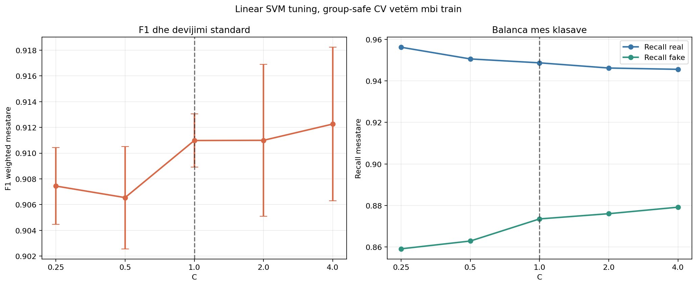
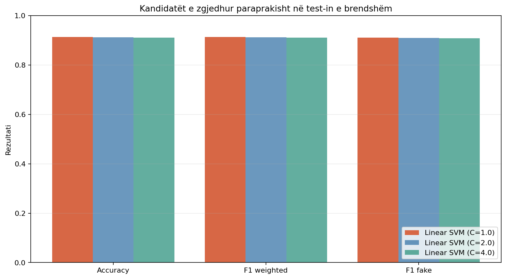
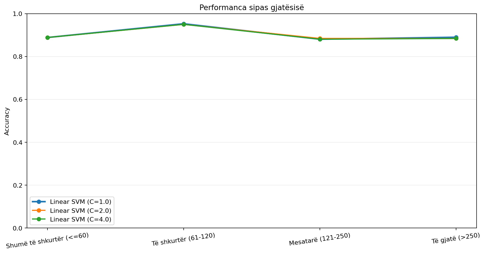
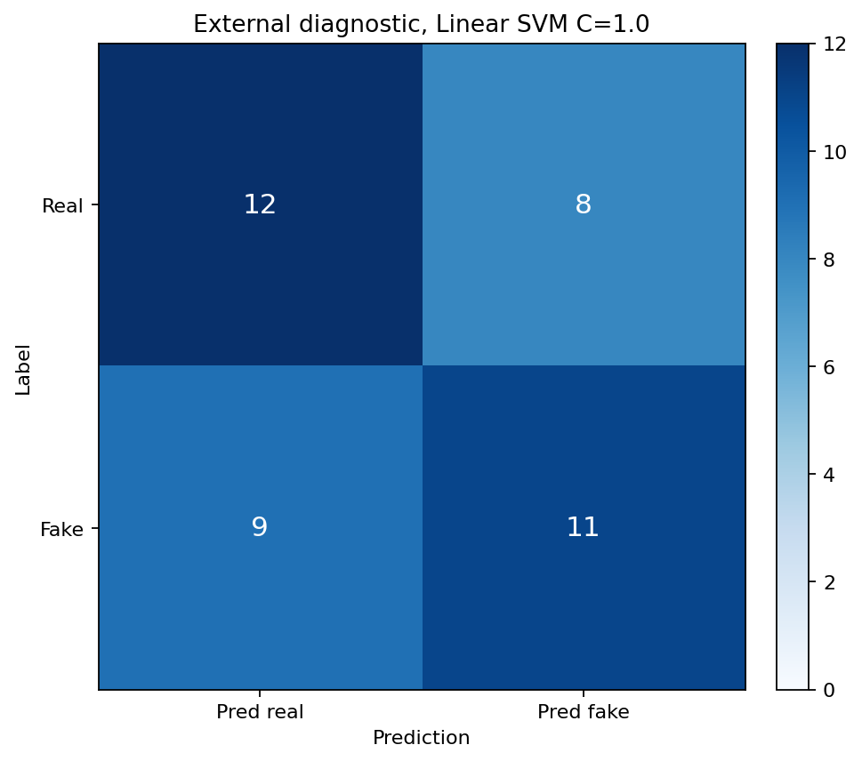

# Dita 15 - Tuning i kufizuar i Linear SVM

## Protokolli

U mbajt fiks përfaqësimi Word TF-IDF `(1,2)` plus Character TF-IDF
`char_wb (3,5)` i Ditës 13. U përdor vetëm train set-i me 5-fold
`StratifiedGroupKFold` dhe 1586 leakage-groups.
Artikujt me `pair_id` ose tekst identik u mbajtën në të njëjtin grup; të pesë
fold-et kishin zero mbivendosje grupesh.

U provuan vetëm `C = 0.25, 0.5, 1.0, 2.0, 4.0`. TF-IDF u
përshtat një herë brenda çdo fold-i dhe nuk pa validation-in. Për shkak të
normalizimit aktual NFC, u rifreskuan vetëm në memorie
21 tekste
train; CSV-të nuk u ndryshuan.

Përzgjedhja u shkrua te `reports/day15_selection.json` përpara se të ngarkohej
test set-i. Dataset-i i jashtëm u hap vetëm pasi vendimi ishte hash-uar. Nuk u
bë calibration, nuk u përdorën pragjet 0.30/0.70 dhe modeli i Streamlit mbeti i
paprekur.

## Cross-validation vetëm mbi train

| c_value | mean_accuracy | mean_f1_weighted | std_f1_weighted | mean_f1_fake | mean_recall_real | mean_recall_fake | mean_recall_gap | mean_generalization_gap | mean_false_positives | mean_false_negatives | mean_training_seconds |
| --- | --- | --- | --- | --- | --- | --- | --- | --- | --- | --- | --- |
| 0.2500 | 0.9077 | 0.9074 | 0.0030 | 0.9029 | 0.9562 | 0.8591 | 0.0971 | 0.0876 | 14.0000 | 45.0000 | 7.6963 |
| 0.5000 | 0.9067 | 0.9065 | 0.0040 | 0.9024 | 0.9506 | 0.8629 | 0.0877 | 0.0920 | 15.8000 | 43.8000 | 7.7724 |
| 1.0000 | 0.9111 | 0.9110 | 0.0021 | 0.9076 | 0.9487 | 0.8735 | 0.0752 | 0.0886 | 16.4000 | 40.4000 | 7.9177 |
| 2.0000 | 0.9111 | 0.9110 | 0.0059 | 0.9078 | 0.9462 | 0.8760 | 0.0702 | 0.0890 | 17.2000 | 39.6000 | 8.1765 |
| 4.0000 | 0.9124 | 0.9123 | 0.0060 | 0.9093 | 0.9456 | 0.8792 | 0.0664 | 0.0877 | 17.4000 | 38.6000 | 8.6882 |

FP/FN për çdo fold ruhen te `reports/day15_cv_fold_results.csv`; tabela paraqet
mesataren për fold. Rregulli përjashtoi recall gap mbi
0.10 kur kishte alternativa dhe konsideroi kandidatët
brenda 0.002 F1 si shumë të afërt. Pastaj preferoi devijimin
standard më të ulët, recall gap më të vogël, generalization gap më të vogël dhe
`C` më të ulët.

U zgjodh **Linear SVM me C=1.0**, me CV F1 weighted
0.9110 ± 0.0021,
F1 fake 0.9076, recall real
0.9487 dhe recall fake
0.8735. Më i qëndrueshmi ishte
`C=1.0`; balancën më të afërt të recall e kishte
`C=4.0`. Stabiliteti kishte përparësi
ndaj ndryshimeve shumë të vogla të mesatares.

## Test set-i i brendshëm

Pas ngrirjes së C u përjashtuan
7 dublikata ekzakte
train/test dhe mbetën 792 raste.
Tre konfigurimet në tabelë u përcaktuan nga CV përpara ngarkimit të test-it.

| candidate_display | accuracy | f1_weighted | f1_fake | recall_real | recall_fake | false_positives | false_negatives | confusion_matrix |
| --- | --- | --- | --- | --- | --- | --- | --- | --- |
| Linear SVM (C=1.0) | 0.9141 | 0.9141 | 0.9112 | 0.9398 | 0.8880 | 24 | 44 | [[375, 24], [44, 349]] |
| Linear SVM (C=2.0) | 0.9129 | 0.9128 | 0.9103 | 0.9348 | 0.8906 | 26 | 43 | [[373, 26], [43, 350]] |
| Linear SVM (C=4.0) | 0.9116 | 0.9116 | 0.9091 | 0.9323 | 0.8906 | 27 | 43 | [[372, 27], [43, 350]] |

Kandidati i ngrirë mori accuracy 0.9141, F1
weighted 0.9141, F1 fake
0.9112, me confusion matrix
`[[375, 24], [44, 349]]`. Test-i nuk ndryshoi përzgjedhjen.

## Gjatësia dhe bias-i

| candidate_display | length_description | rows | accuracy | recall_real | recall_fake |
| --- | --- | --- | --- | --- | --- |
| Linear SVM (C=1.0) | Shumë të shkurtër (<=60) | 9 | 0.8889 | 0.8333 | 1.0000 |
| Linear SVM (C=1.0) | Të shkurtër (61-120) | 341 | 0.9531 | 0.9067 | 0.9662 |
| Linear SVM (C=1.0) | Mesatarë (121-250) | 269 | 0.8810 | 0.9253 | 0.8000 |
| Linear SVM (C=1.0) | Të gjatë (>250) | 173 | 0.8902 | 0.9792 | 0.4483 |
| Linear SVM (C=2.0) | Shumë të shkurtër (<=60) | 9 | 0.8889 | 0.8333 | 1.0000 |
| Linear SVM (C=2.0) | Të shkurtër (61-120) | 341 | 0.9501 | 0.8933 | 0.9662 |
| Linear SVM (C=2.0) | Mesatarë (121-250) | 269 | 0.8848 | 0.9253 | 0.8105 |
| Linear SVM (C=2.0) | Të gjatë (>250) | 173 | 0.8844 | 0.9722 | 0.4483 |
| Linear SVM (C=4.0) | Shumë të shkurtër (<=60) | 9 | 0.8889 | 0.8333 | 1.0000 |
| Linear SVM (C=4.0) | Të shkurtër (61-120) | 341 | 0.9501 | 0.8933 | 0.9662 |
| Linear SVM (C=4.0) | Mesatarë (121-250) | 269 | 0.8810 | 0.9195 | 0.8105 |
| Linear SVM (C=4.0) | Të gjatë (>250) | 173 | 0.8844 | 0.9722 | 0.4483 |

Cohort-et e skajeve:

| candidate_display | cohort | rows | accuracy | recall_real | recall_fake | confusion_matrix |
| --- | --- | --- | --- | --- | --- | --- |
| Linear SVM (C=1.0) | real_30_60 | 6 | 0.8333 | 0.8333 | 0.0000 | [[5, 1], [0, 0]] |
| Linear SVM (C=1.0) | fake_gt_250 | 29 | 0.4483 | 0.0000 | 0.4483 | [[0, 0], [16, 13]] |
| Linear SVM (C=2.0) | real_30_60 | 6 | 0.8333 | 0.8333 | 0.0000 | [[5, 1], [0, 0]] |
| Linear SVM (C=2.0) | fake_gt_250 | 29 | 0.4483 | 0.0000 | 0.4483 | [[0, 0], [16, 13]] |
| Linear SVM (C=4.0) | real_30_60 | 6 | 0.8333 | 0.8333 | 0.0000 | [[5, 1], [0, 0]] |
| Linear SVM (C=4.0) | fake_gt_250 | 29 | 0.4483 | 0.0000 | 0.4483 | [[0, 0], [16, 13]] |

| candidate_display | spearman_all | spearman_real | spearman_fake | mean_absolute_within_label_spearman | real_30_60_accuracy | fake_gt_250_accuracy |
| --- | --- | --- | --- | --- | --- | --- |
| Linear SVM (C=1.0) | -0.6122 | -0.3045 | -0.4351 | 0.3698 | 0.8333 | 0.4483 |
| Linear SVM (C=2.0) | -0.6026 | -0.2773 | -0.4251 | 0.3512 | 0.8333 | 0.4483 |
| Linear SVM (C=4.0) | -0.5964 | -0.2616 | -0.4181 | 0.3398 | 0.8333 | 0.4483 |

Spearman përdor raw decision score të Linear SVM, jo probabilitet. Kundrejt
C=1.0, kandidati ndryshoi mean absolute within-label correlation nga
0.3698 në
0.3698.
Vlerën më të ulët e pati C=4.0, me
0.3398, por të tre kandidatët
morën të njëjtin rezultat te real 30-60 dhe fake mbi 250 fjalë. Pra tuning-u
nuk solli përmirësim praktik në cohort-et e skajeve.

## Krahasimi me C=1.0

Tuning-u konfirmoi C=1.0. C=4.0 kishte F1 mesatare vetëm +0.0013 më të lartë, por devijimi i tij standard ishte 0.0060 kundrejt 0.0021 te C=1.0. Përmirësimi ishte shumë i vogël dhe më pak i qëndrueshëm. Recall gap ishte 0.0664 kundrejt 0.0752. Generalization gap nuk u rrit, por regularizimi më i dobët dhe varianca më e lartë nuk justifikojnë rrezikun shtesë të kompleksitetit.

- CV F1 weighted: 0.9110 te C=1.0 kundrejt
  0.9110 te C=1.0.
- CV recall gap: 0.0752 kundrejt
  0.0752.
- Internal F1 weighted: 0.9141 kundrejt
  0.9141.
- Internal recall real/fake te kandidati: 0.9398
  / 0.8880.

## Dataset-i i jashtëm vetëm diagnostik

U ekzekutua vetëm kandidati i ngrirë:

| candidate_display | accuracy | recall_real | recall_fake | false_positives | false_negatives | confusion_matrix |
| --- | --- | --- | --- | --- | --- | --- |
| Linear SVM (C=1.0) | 0.5750 | 0.6000 | 0.5500 | 8 | 9 | [[12, 8], [9, 11]] |

Rezultati i jashtëm nuk u përdor për të ndryshuar `C`.

## Rekomandimi për Ditën 16

Rekomandohet **Word + Character TF-IDF + Linear SVM, C=1.0** për
probability calibration të kontrolluar. Konfigurimi mbetet i pakalibruar dhe
nuk duhet integruar ende në Streamlit.

## Kufizimet

- U provuan vetëm pesë vlera të paracaktuara të `C`.
- Tuning-u bazohet në të njëjtin corpus si test-i i brendshëm.
- Cohort-et diagnostike kanë pak shembuj në skajet e gjatësisë.
- Decision score nuk është probabilitet.
- Benchmark-u i jashtëm ka domain shift dhe source-label confounding; ai nuk
  është validation set.
- Calibration dhe kontrolli i pragjeve mbeten për Ditën 16.

Modelet e tre kandidatëve të përcaktuar nga CV ruhen te
`models/day15_word_char_linear_svm_c_*.joblib`.

Modeli aktual `models/calibrated_tfidf_logreg.joblib` nuk u zëvendësua.
