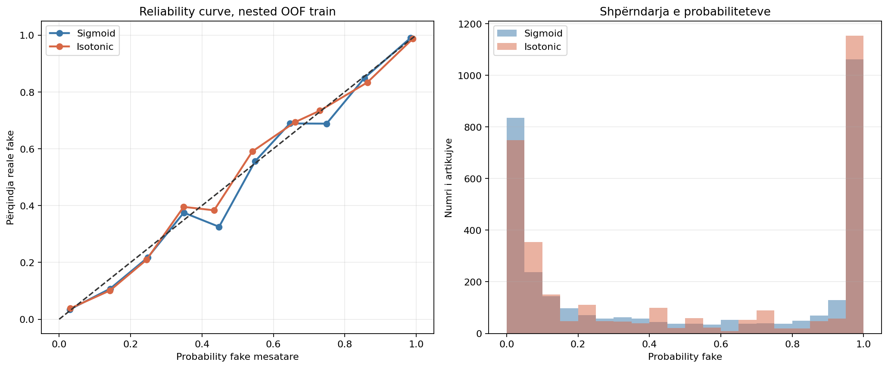
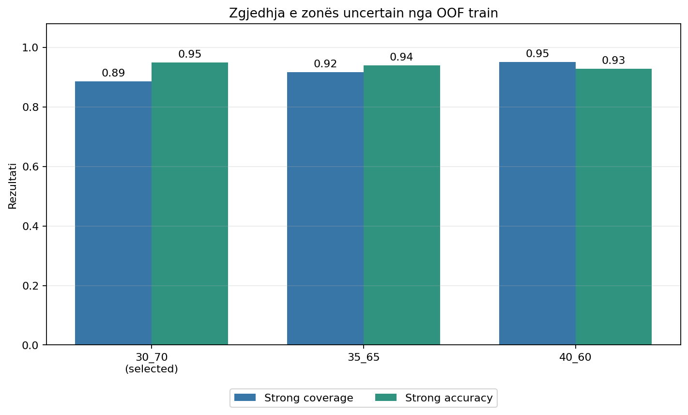
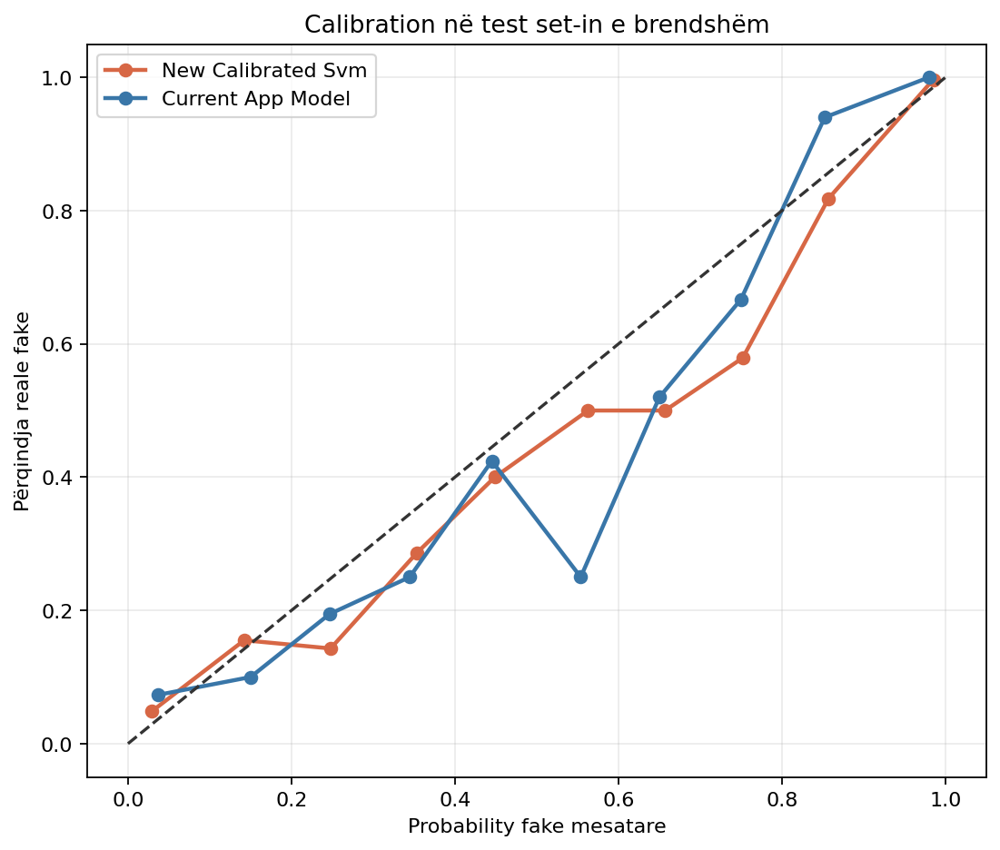
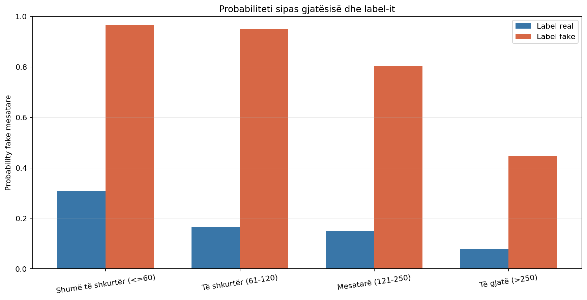
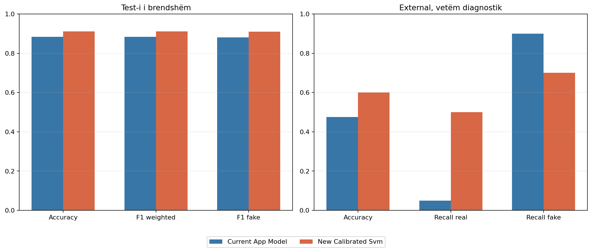

# Dita 16 - Calibration dhe pragjet uncertain

## Protokolli

Konfigurimi u mbajt fiks: Word + Character TF-IDF, Linear SVM, `C=1.0`.
Sigmoid dhe isotonic u krahasuan me nested 5x5 group-safe CV vetëm mbi
3195 artikujt train dhe
1586 leakage-groups. Outer folds prodhuan
probabilitete OOF për vlerësim; inner folds trajnuan calibration-in. Në asnjë
nivel nuk pati mbivendosje grupesh.

Metoda dhe pragjet u shkruan te `reports/day16_selection.json` përpara se të
ngarkoheshin test-i i brendshëm, modeli aktual i aplikacionit ose dataset-i i
jashtëm. Streamlit dhe modeli aktual nuk u zëvendësuan.

## Krahasimi i calibration-it në OOF train

| method | brier_score | log_loss | ece | accuracy | f1_weighted | f1_fake | std_brier_score | std_f1_weighted | high_confidence_predictions | high_confidence_errors | mean_training_seconds |
| --- | --- | --- | --- | --- | --- | --- | --- | --- | --- | --- | --- |
| sigmoid | 0.0653 | 0.2175 | 0.0149 | 0.9133 | 0.9133 | 0.9119 | 0.0040 | 0.0061 | 2263 | 49 | 49.5828 |
| isotonic | 0.0659 | 0.2475 | 0.0138 | 0.9114 | 0.9114 | 0.9095 | 0.0047 | 0.0042 | 2313 | 57 | 48.4287 |

U zgjodh **sigmoid**. Arsyeja e ruajtur ishte
`sigmoid_within_tolerance_and_lower_overfitting_risk`. Brier score ishte
0.0653, log loss
0.2175 dhe ECE
0.0149. Sigmoid preferohet ndaj isotonic kur është
brenda tolerancës, sepse ka formë parametrike dhe rrezik më të ulët overfitting.

### Shpërndarja e probabiliteteve

| method | true_label | rows | mean | std | p10 | median | p90 |
| --- | --- | --- | --- | --- | --- | --- | --- |
| sigmoid | all | 3195 | 0.5025 | 0.4269 | 0.0094 | 0.4337 | 0.9988 |
| sigmoid | real | 1598 | 0.1358 | 0.1968 | 0.0043 | 0.0472 | 0.4119 |
| sigmoid | fake | 1597 | 0.8695 | 0.2379 | 0.4980 | 0.9861 | 0.9996 |
| isotonic | all | 3195 | 0.5022 | 0.4299 | 0.0094 | 0.4306 | 1.0000 |
| isotonic | real | 1598 | 0.1334 | 0.1932 | 0.0046 | 0.0571 | 0.4274 |
| isotonic | fake | 1597 | 0.8712 | 0.2451 | 0.4375 | 0.9941 | 1.0000 |

## Zgjedhja e pragjeve nga OOF train

| threshold_name | likely_real | uncertain | likely_fake | strong_coverage | strong_accuracy | errors_in_uncertain | strong_false_positives | strong_false_negatives |
| --- | --- | --- | --- | --- | --- | --- | --- | --- |
| 30_70 | 1444 | 365 | 1386 | 0.8858 | 0.9488 | 132 | 54 | 91 |
| 35_65 | 1506 | 266 | 1423 | 0.9167 | 0.9403 | 102 | 64 | 111 |
| 40_60 | 1564 | 155 | 1476 | 0.9515 | 0.9283 | 59 | 82 | 136 |

U zgjodhën pragjet **0.30/0.70**. Variantet brenda 0.005 strong
accuracy nga më i miri u krahasuan sipas coverage, kapjes së gabimeve dhe
gabimeve të forta. Test set-i nuk u përdor.

## Test set-i i brendshëm

Pas ngrirjes u përjashtuan
7 dublikata ekzakte
dhe mbetën 792 artikuj.

| model | accuracy | f1_weighted | f1_fake | recall_real | recall_fake | brier_score | log_loss | ece | high_confidence_errors | confusion_matrix |
| --- | --- | --- | --- | --- | --- | --- | --- | --- | --- | --- |
| new_calibrated_svm | 0.9116 | 0.9116 | 0.9098 | 0.9248 | 0.8982 | 0.0658 | 0.2192 | 0.0285 | 15 | [[369, 30], [40, 353]] |
| current_app_model | 0.8838 | 0.8838 | 0.8808 | 0.9023 | 0.8651 | 0.0809 | 0.2816 | 0.0498 | 18 | [[360, 39], [53, 340]] |

Modeli i ri arriti accuracy 0.9116, F1 weighted
0.9116, F1 fake 0.9098,
Brier 0.0658, log loss
0.2192 dhe ECE 0.0285. Gabimet me
confidence të paktën 90% ishin 15.

Me pragjet e ngrira:

| model | likely_real | uncertain | likely_fake | strong_coverage | strong_accuracy | errors_in_uncertain | strong_false_positives | strong_false_negatives |
| --- | --- | --- | --- | --- | --- | --- | --- | --- |
| new_calibrated_svm | 368 | 71 | 353 | 0.9104 | 0.9431 | 29 | 15 | 26 |
| current_app_model | 352 | 110 | 330 | 0.8611 | 0.9399 | 51 | 9 | 32 |

## Sjellja sipas gjatësisë

| length_description | rows | accuracy | f1_weighted | recall_real | recall_fake | brier_score | ece | mean_probability_fake_real | mean_probability_fake_fake |
| --- | --- | --- | --- | --- | --- | --- | --- | --- | --- |
| Shumë të shkurtër (<=60) | 9 | 0.8889 | 0.8918 | 0.8333 | 1.0000 | 0.1323 | 0.1945 | 0.3086 | 0.9662 |
| Të shkurtër (61-120) | 341 | 0.9560 | 0.9559 | 0.8933 | 0.9737 | 0.0334 | 0.0288 | 0.1643 | 0.9495 |
| Mesatarë (121-250) | 269 | 0.8773 | 0.8772 | 0.9080 | 0.8211 | 0.0868 | 0.0539 | 0.1485 | 0.8030 |
| Të gjatë (>250) | 173 | 0.8786 | 0.8666 | 0.9653 | 0.4483 | 0.0933 | 0.0490 | 0.0775 | 0.4478 |

| cohort | rows | accuracy | recall_real | recall_fake | mean_probability_fake | threshold_uncertain | confusion_matrix |
| --- | --- | --- | --- | --- | --- | --- | --- |
| real_30_60 | 6 | 0.8333 | 0.8333 | 0.0000 | 0.3086 | 1 | [[5, 1], [0, 0]] |
| fake_gt_250 | 29 | 0.4483 | 0.0000 | 0.4483 | 0.4478 | 9 | [[0, 0], [16, 13]] |

Mean absolute within-label Spearman ishte 0.3698 pas calibration,
kundrejt 0.3698 për raw decision score në Ditën 15. Calibration nuk
e zgjidhi bias-in e gjatësisë; ndryshimi interpretohet vetëm si transformim i
score-it në probability.

## Dataset-i i jashtëm vetëm diagnostik

| model | accuracy | recall_real | recall_fake | brier_score | log_loss | ece | high_confidence_errors | confusion_matrix |
| --- | --- | --- | --- | --- | --- | --- | --- | --- |
| new_calibrated_svm | 0.6000 | 0.5000 | 0.7000 | 0.2377 | 0.6710 | 0.2347 | 1 | [[10, 10], [6, 14]] |
| current_app_model | 0.4750 | 0.0500 | 0.9000 | 0.3218 | 0.8923 | 0.3468 | 3 | [[1, 19], [2, 18]] |

Për modelin e ri, pragjet e ngrira dhanë:

| model | likely_real | uncertain | likely_fake | strong_coverage | strong_accuracy | errors_in_uncertain | strong_false_positives | strong_false_negatives |
| --- | --- | --- | --- | --- | --- | --- | --- | --- |
| new_calibrated_svm | 8 | 19 | 13 | 0.5250 | 0.7143 | 10 | 2 | 4 |
| current_app_model | 1 | 8 | 31 | 0.8000 | 0.5625 | 7 | 13 | 1 |

Brier/log loss i jashtëm raportohet sepse rastet kanë etiketa të dokumentuara,
por kampioni ka vetëm 40 përmbledhje dhe nuk është calibration set. Asnjë
rezultat i jashtëm nuk ndryshoi metodën ose pragjet.

## Krahasimi me modelin aktual të aplikacionit

- Në test-in e brendshëm, F1 weighted ndryshoi nga
  0.8838 në 0.9116;
  Brier nga 0.0809 në
  0.0658.
- Jashtë corpus-it, accuracy ndryshoi nga 0.4750 në
  0.6000; recall real/fake i modelit të ri ishte
  0.5000/0.7000.
- Modeli i ri fiton përfaqësim character dhe performancë të brendshme më të
  lartë; humbet thjeshtësinë e Logistic Regression dhe mbetet i ekspozuar ndaj
  domain shift-it dhe bias-it të gjatësisë.

## Rekomandimi për Ditën 17

Rekomandohet **Word + Character TF-IDF + Linear SVM, C=1.0 + sigmoid** me
pragje **0.30/0.70** si kandidat për ngrirjen finale. Para
integrimit duhen verifikuar artefakti, funksioni i prediction, versionet e
dependencies dhe testet e regresionit të Streamlit.

## Kufizimet

- Calibration selection përdor nested CV, por ende të njëjtin corpus burimor.
- ECE varet nga 10 bin-et e zgjedhura.
- Isotonic ka mjaft raste, por mund të overfit-ojë më lehtë se sigmoid.
- Calibration nuk korrigjon domain shift, source-label confounding ose bias-in
  e gjatësisë.
- Benchmark-u i jashtëm është i vogël dhe me përmbledhje manuale.
- Modeli i ri nuk është integruar ende në Streamlit.

Modeli eksperimental ruhet te
`models/day16_word_char_linear_svm_calibrated.joblib`.
