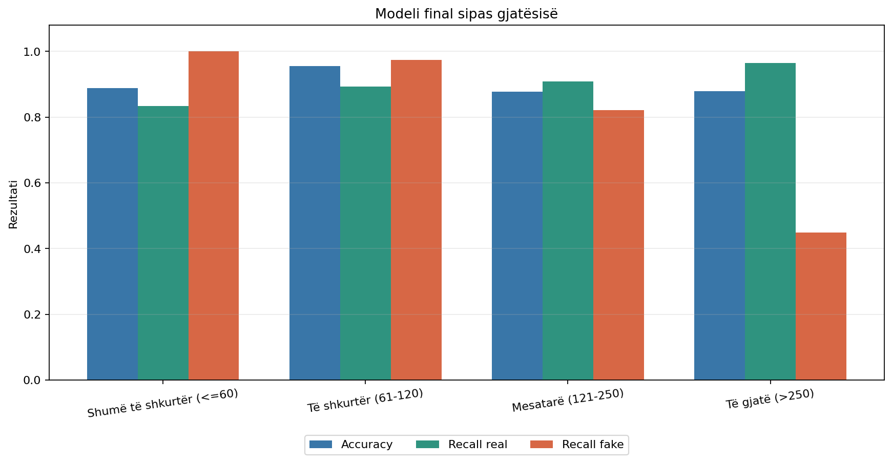

# Dita 17 - Modeli final klasik

## Vendimi

Modeli **është gati të konsiderohet final** për pipeline-in klasik të projektit:

`Word + Character TF-IDF + Linear SVM (C=1.0) + sigmoid calibration`.

Pragjet janë ngrirë në `0.30/0.70`. Nuk u bë tuning, trajnim, ndryshim
classifier-i, ndryshim TF-IDF ose zgjedhje nga benchmark-u i jashtëm.
Artefakti final është kopje byte-for-byte e kandidatit të Ditës 16.

## Artefakti

- Versioni: `1.0.0`
- Model ID: `albanian_fake_news_word_char_svm_sigmoid_v1`
- Path: `models\final_word_char_linear_svm_calibrated_v1.joblib`
- SHA-256: `52ccbc976b10b4a5749e9814d736661ec66c95e1218a19692bdb0ea53dab11d5`
- Madhësia: 1.351 MB
- Manifesti: `models/final_model_v1_manifest.json`

## Konfigurimi i ngrirë

- Train: 3195 artikuj, me
  1598 real dhe 1597 fake.
- Preprocessing: Unicode NFC, normalizim hapësirash, bashkim
  `title + ". " + content`; ruhen kapitalizimi, pikësimi dhe ë/ç.
- Word TF-IDF: n-grams 1-2, `min_df=2`, `max_features=30000`, pa lowercase.
- Character TF-IDF: `char_wb` n-grams 3-5, `min_df=2`,
  `max_features=50000`, pa lowercase.
- Classifier: Linear SVM, `C=1.0`, `class_weight="balanced"`.
- Calibration: sigmoid me 5 fold-e group-safe, pa overlap grupesh.
- Vendimi: `<0.30 likely_real`, `0.30-0.70 uncertain`, `>0.70 likely_fake`.

## Regression checks

| case_id | probability_real | probability_fake | decision | expected_decision | matches_expected_anchor | probability_sum_error | source_final_max_difference | reload_max_difference | model_text_is_nfc |
| --- | --- | --- | --- | --- | --- | --- | --- | --- | --- |
| official_style | 0.1393 | 0.8607 | likely_fake | not_fixed | True | 0.0000 | 0.0000 | 0.0000 | True |
| clickbait_style | 0.0004 | 0.9996 | likely_fake | not_fixed | True | 0.0000 | 0.0000 | 0.0000 | True |
| title_only | 0.2997 | 0.7003 | likely_fake | not_fixed | True | 0.0000 | 0.0000 | 0.0000 | True |
| content_only | 0.0124 | 0.9876 | likely_fake | not_fixed | True | 0.0000 | 0.0000 | 0.0000 | True |
| unicode_nfc | 0.0169 | 0.9831 | likely_fake | not_fixed | True | 0.0000 | 0.0000 | 0.0000 | True |
| unicode_nfd | 0.0169 | 0.9831 | likely_fake | not_fixed | True | 0.0000 | 0.0000 | 0.0000 | True |
| known_likely_real | 0.9999 | 0.0001 | likely_real | likely_real | True | 0.0000 | 0.0000 | 0.0000 | True |
| known_uncertain | 0.5028 | 0.4972 | uncertain | uncertain | True | 0.0000 | 0.0000 | 0.0000 | True |
| known_likely_fake | 0.0000 | 1.0000 | likely_fake | likely_fake | True | 0.0000 | 0.0000 | 0.0000 | True |

Të gjitha probabilitetet ishin në `[0,1]`, shuma ishte 1, vendimet ndoqën
pragjet, reload-i dha rezultate identike dhe preprocessing-u i prediction ishte
identik me evaluation për të 792 rreshtat.

## Metrikat zyrtare të brendshme

| model | accuracy | f1_weighted | f1_fake | recall_real | recall_fake | brier_score | log_loss | ece | high_confidence_errors | threshold_strong_coverage | threshold_strong_accuracy | confusion_matrix |
| --- | --- | --- | --- | --- | --- | --- | --- | --- | --- | --- | --- | --- |
| baseline_word_logreg | 0.8838 | 0.8838 | 0.8808 | 0.9023 | 0.8651 | 0.0809 | 0.2816 | 0.0498 | 18 | 0.8611 | 0.9399 | [[360, 39], [53, 340]] |
| final_word_char_svm | 0.9116 | 0.9116 | 0.9098 | 0.9248 | 0.8982 | 0.0658 | 0.2192 | 0.0285 | 15 | 0.9104 | 0.9431 | [[369, 30], [40, 353]] |

Modeli final arriti accuracy 0.9116, F1 weighted
0.9116, F1 fake 0.9098,
Brier 0.0658, log loss
0.2192 dhe ECE 0.0285.
Këto janë metrikat zyrtare që duhen përdorur në diplomë.

## Benchmark-u i jashtëm pilot

| model | accuracy | recall_real | recall_fake | brier_score | log_loss | high_confidence_errors | threshold_likely_real | threshold_uncertain | threshold_likely_fake | threshold_strong_coverage | threshold_strong_accuracy | confusion_matrix |
| --- | --- | --- | --- | --- | --- | --- | --- | --- | --- | --- | --- | --- |
| baseline_word_logreg | 0.4750 | 0.0500 | 0.9000 | 0.3218 | 0.8923 | 3 | 1 | 8 | 31 | 0.8000 | 0.5625 | [[1, 19], [2, 18]] |
| final_word_char_svm | 0.6000 | 0.5000 | 0.7000 | 0.2377 | 0.6710 | 1 | 8 | 19 | 13 | 0.5250 | 0.7143 | [[10, 10], [6, 14]] |

Modeli final arriti accuracy 0.6000, recall real
0.5000 dhe recall fake
0.7000. Ky benchmark ka 40 përmbledhje të shkurtra,
domain shift në gjatësi, stil, periudhë dhe lloj burimi. Përdoret vetëm si
vlerësim pilot; nuk u përdor për tuning, calibration, pragje ose ngrirjen e
modelit.

Gabimet e modelit final me confidence të paktën 90%:

| case_id | label | binary_prediction | title | probability_fake | confidence |
| --- | --- | --- | --- | --- | --- |
| EXT-R-010 | 0 | 1 | Fondi i Ndërhyrjes së Jashtëzakonshme arrin 8.22 miliardë lekë | 0.9066 | 0.9066 |

## Rezultatet sipas gjatësisë

| length_description | rows | real_rows | fake_rows | accuracy | recall_real | recall_fake | mean_probability_fake_real | mean_probability_fake_fake | confusion_matrix |
| --- | --- | --- | --- | --- | --- | --- | --- | --- | --- |
| Shumë të shkurtër (<=60) | 9 | 6 | 3 | 0.8889 | 0.8333 | 1.0000 | 0.3086 | 0.9662 | [[5, 1], [0, 3]] |
| Të shkurtër (61-120) | 341 | 75 | 266 | 0.9560 | 0.8933 | 0.9737 | 0.1643 | 0.9495 | [[67, 8], [7, 259]] |
| Mesatarë (121-250) | 269 | 174 | 95 | 0.8773 | 0.9080 | 0.8211 | 0.1485 | 0.8030 | [[158, 16], [17, 78]] |
| Të gjatë (>250) | 173 | 144 | 29 | 0.8786 | 0.9653 | 0.4483 | 0.0775 | 0.4478 | [[139, 5], [16, 13]] |

| cohort | rows | accuracy | recall_real | recall_fake | mean_probability_fake | threshold_uncertain | confusion_matrix |
| --- | --- | --- | --- | --- | --- | --- | --- |
| real_30_60 | 6 | 0.8333 | 0.8333 | 0.0000 | 0.3086 | 1 | [[5, 1], [0, 0]] |
| fake_gt_250 | 29 | 0.4483 | 0.0000 | 0.4483 | 0.4478 | 9 | [[0, 0], [16, 13]] |

Calibration nuk e zgjidh bias-in e gjatësisë. Veçanërisht, fake mbi 250 fjalë
mbeten një grup i vështirë, ndërsa grupi 30-60 fjalë ka shumë pak raste të
brendshme dhe duhet interpretuar me kujdes.

## Rastet finale të demonstrimit

| demo_type | article_id | title | true_label | binary_prediction | decision | probability_real | probability_fake | explanation |
| --- | --- | --- | --- | --- | --- | --- | --- | --- |
| likely_real_correct | true_1594 | Shqipëri, një i vdekur dhe 53 raste të reja me COVID-19 | real | real | likely_real | 0.9999 | 0.0001 | Vendimi likely_real përputhet me label-in real. Sinjale të vëzhguara: gjatesia 169 fjale; tregues burimi: sipas, ministria; uppercase ratio 0.071; diacritic ratio 0.073. Këto sinjale përshkruajnë sjelljen e modelit, jo vërtetësinë faktike. |
| likely_fake_correct | fake_531 | EKSKLUZIVE: Albin Kurti President i Kosoves? | fake | fake | likely_fake | 0.0000 | 1.0000 | Vendimi likely_fake përputhet me label-in fake. Sinjale të vëzhguara: gjatesia 86 fjale; markues sensacional: ekskluzive; uppercase ratio 0.084; diacritic ratio 0.004. Këto sinjale përshkruajnë sjelljen e modelit, jo vërtetësinë faktike. |
| uncertain | true_585 | Sejdiu i gatshëm të kandidojë për president, nëse dorëhiqet Thaçi | real | real | uncertain | 0.5028 | 0.4972 | Probability fake 0.497 bie brenda zonës 0.30-0.70. Sinjale të vëzhguara: gjatesia 152 fjale; uppercase ratio 0.070; diacritic ratio 0.062. Këto sinjale përshkruajnë sjelljen e modelit, jo vërtetësinë faktike. |
| false_positive | true_586 | Menjëherë fshijeni nësë ju vjen ky mesazh në telefon | real | fake | likely_fake | 0.1036 | 0.8964 | Artikulli real u shty gabimisht drejt fake. Sinjale të vëzhguara: gjatesia 206 fjale; uppercase ratio 0.018; diacritic ratio 0.085. Këto sinjale përshkruajnë sjelljen e modelit, jo vërtetësinë faktike. |
| false_negative | fake_1104 | Nuk hapen xhamitë as në ditët e fundit të Ramazanit, edhe ne Hoxhallarët duam pushim | fake | real | likely_real | 0.8941 | 0.1059 | Artikulli fake u shty gabimisht drejt real. Sinjale të vëzhguara: gjatesia 378 fjale; uppercase ratio 0.034; diacritic ratio 0.089. Këto sinjale përshkruajnë sjelljen e modelit, jo vërtetësinë faktike. |
| high_confidence_error | fake_1932 | Flet mjekja shqiptare në Kanada: Si të trajtoni virusin në kushtet e shtëpisë | fake | real | likely_real | 0.9992 | 0.0008 | Ky është një gabim i rëndësishëm sepse confidence kalon 90%. Sinjale të vëzhguara: gjatesia 2376 fjale; 1 pikëçuditëse; uppercase ratio 0.021; diacritic ratio 0.083. Këto sinjale përshkruajnë sjelljen e modelit, jo vërtetësinë faktike. |

Shpjegimet janë përshkruese dhe bazohen në sinjale të vëzhgueshme; ato nuk janë
shpjegime shkakësore ose fact-checking.

## Kufizimet

- Modeli analizon ngjashmëri tekstuale dhe stilistike, jo fakte, URL, autorë,
  prova ose burime reale.
- Corpus-i ka lidhje mes label-it, gjatësisë dhe llojit të burimit.
- Tekstet shumë të shkurtra dhe fake shumë të gjata mbeten problematike.
- Benchmark-u i jashtëm është i vogël dhe me përmbledhje manuale.
- Probability calibration nuk garanton calibration të njëjtë pas domain shift-it.
- Rezultati duhet paraqitur si probabilitet sipas modelit dhe duhet shoqëruar me
  paralajmërim për verifikim faktik.

## Dita 18

Dita 18 duhet vetëm të kalojë Streamlit te `predict_final_news()`, të përdorë
artefaktin final dhe manifestin, të ruajë pragjet 0.30/0.70, dhe të ekzekutojë
testet e regresionit të UI-së. Modeli klasik nuk duhet ndryshuar më, përveç një
bug-u real të dokumentuar.
