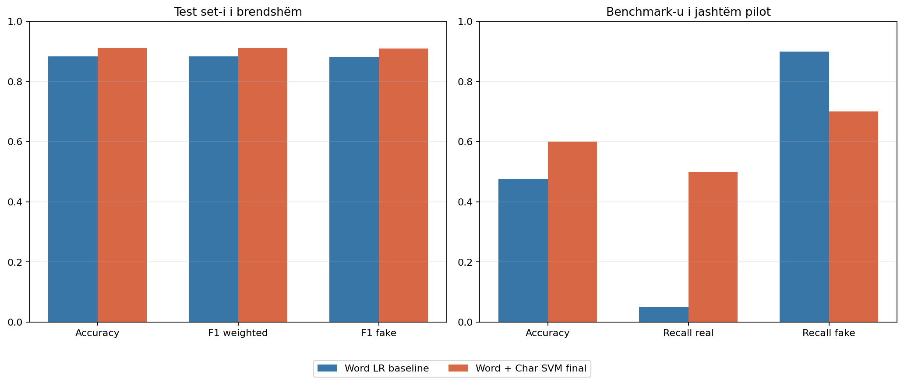
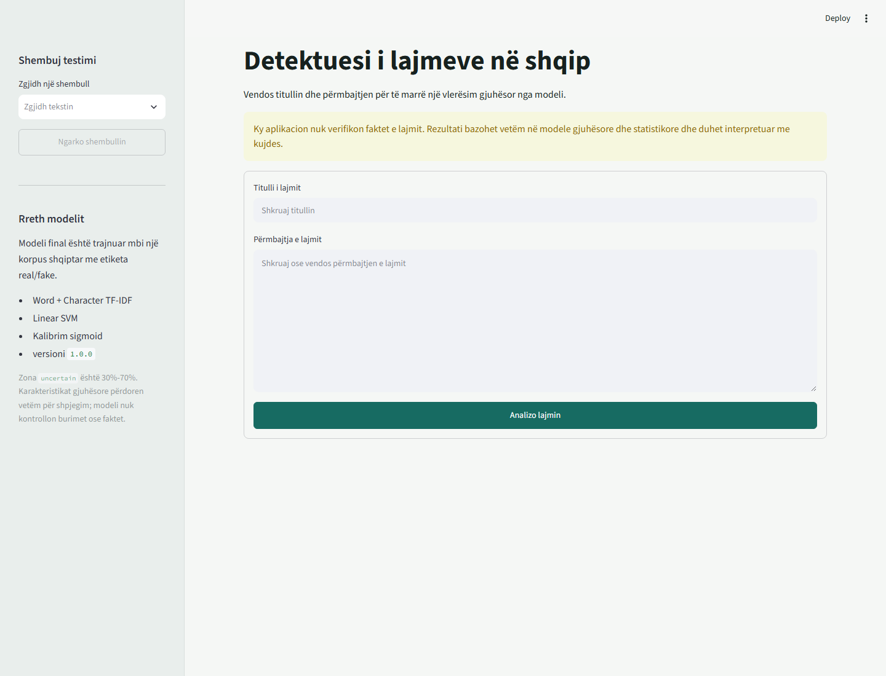

# Raporti Final i Eksperimenteve dhe Modelit

## Përmbledhje

Ky raport paraqet eksperimentet që çuan te konfigurimi final i Albanian Fake
News Detector. Eksperimentet historike ruhen te `archive/experiments/`, ndërsa
ky dokument përmbledh vetëm metodën, vendimin dhe përfundimin e secilit prej
tyre.

Modeli final është:

```text
Word TF-IDF + Character TF-IDF
→ Linear SVM, C=1.0
→ sigmoid probability calibration
→ thresholds 0.30/0.70
```

Benchmark-u i jashtëm është përdorur vetëm për vlerësim diagnostik. Ai nuk ka
ndikuar në përfaqësimin, classifier-in, tuning-un, calibration-in ose
thresholds.

## Ndërtimi dhe Validimi i Dataset-it

Corpus-i u lexua nga skedarët raw duke ruajtur titullin, përmbajtjen, label-in,
identifikuesin e çiftit dhe path-in burimor. U kontrolluan kolonat e kërkuara,
tekstet bosh, dublikatat, shpërndarja e klasave dhe çiftet real/fake.

Dataset-i përmban 3,994 artikuj. Split-i i ngrirë përmban 3,195 artikuj train
dhe 799 artikuj test. Shtatë artikuj të test-it kishin tekst identik me train
set-in dhe u përjashtuan vetëm nga evaluation, duke lënë 792 raste zyrtare.

**Përfundimi:** dataset-i është i përdorshëm për eksperimentet, por kërkon
grupim leakage-safe sipas `pair_id` dhe tekstit identik. Split-et e ngrira nuk
duhet të ndryshohen.

## Preprocessing-u

Preprocessing-u normalizon tekstin në Unicode NFC, unifikon hapësirat dhe
bashkon titullin me përmbajtjen përmes ndarësit `". "`. Kapitalizimi, pikësimi
dhe shkronjat `ë/ç` ruhen sepse janë sinjale të dobishme për Word dhe Character
TF-IDF.

**Përfundimi:** preprocessing-u minimal ruan informacionin stilistik dhe jep
të njëjtin tekst për input-e Unicode NFC dhe NFD. I njëjti funksion përdoret në
evaluation dhe prediction.

## Baseline Minimal

Një `DummyClassifier` shërbeu si pikë reference pa informacion tekstual. Në
test set-in zyrtar arriti accuracy `0.5038`, F1 weighted `0.3376` dhe F1 fake
`0.0000`.

**Përfundimi:** rezultatet e modeleve tekstuale janë dukshëm mbi një classifier
trivial; përmirësimi nuk vjen vetëm nga balanca e klasave.

## Baseline Word TF-IDF

Modeli fillestar përdori Word TF-IDF dhe Logistic Regression. Në evaluation-in
e standardizuar me 792 raste arriti:

| Metrika | Rezultati |
|---|---:|
| Accuracy | 0.8838 |
| F1 weighted | 0.8838 |
| F1 fake | 0.8808 |
| Recall real | 0.9023 |
| Recall fake | 0.8651 |

**Përfundimi:** Word TF-IDF krijoi një baseline të fortë dhe interpretable,
por kishte më shumë false negatives për klasën fake dhe kufizime në tekste me
strukturë ose ortografi të ndryshme.

## Linguistic Features

U nxorën karakteristika që përshkruajnë gjatësinë, strukturën e fjalive,
kapitalizimin, pikësimin, fjalët sensacionale, treguesit e burimit, shprehjet e
pasigurisë dhe përdorimin e diakritikave. Dallimet ndërmjet klasave u analizuan
me Mann–Whitney U dhe Cohen's d.

Modeli që përdori vetëm linguistic features arriti accuracy `0.8273` dhe F1
fake `0.8249`.

**Përfundimi:** karakteristikat gjuhësore përmbajnë sinjal klasifikues, por nuk
janë aq të forta sa TF-IDF. Disa prej tyre, sidomos gjatësia, mund të pasqyrojnë
bias të corpus-it dhe jo dallim të përgjithshëm ndërmjet lajmeve real dhe fake.

## Krahasimi i Modelit Hybrid

U krahasuan katër variante:

- vetëm TF-IDF;
- vetëm linguistic features;
- TF-IDF dhe të gjitha linguistic features;
- TF-IDF dhe linguistic features pa karakteristikat direkte të gjatësisë.

| Varianti | Accuracy | F1 fake |
|---|---:|---:|
| TF-IDF | 0.8977 | 0.8919 |
| Linguistic only | 0.8270 | 0.8237 |
| Hybrid | 0.8902 | 0.8863 |
| Hybrid pa length features | 0.8914 | 0.8883 |

**Përfundimi:** bashkimi i linguistic features me TF-IDF nuk e përmirësoi
baseline-in. Për modelin final ato u lanë jashtë prediction-it dhe u ruajtën
vetëm për analizë dhe shpjegim në ndërfaqe.

## Analiza e Probabiliteteve dhe Thresholds Fillestare

Baseline-i Logistic Regression u analizua për gabime, calibration dhe zona të
pasigurisë. Sigmoid calibration uli accuracy nga `0.8977` në `0.8826` në këtë
fazë, por krijoi probabilitete të përdorshme për vendime me tri nivele.

Nga variantet e provuara, zona `0.30–0.70` ishte më konservatorja dhe dha
saktësinë më të lartë për vendimet e forta.

**Përfundimi:** një vendim binar në pragun `0.50` fsheh pasigurinë. Zona
`uncertain` është e nevojshme, por calibration nuk eliminon gabimet me
confidence të lartë.

## Testimi i Kontratës së Aplikacionit

U kontrolluan probabilitetet, kufijtë e thresholds, Unicode NFC/NFD, input-et
bosh ose jo-informuese, paralajmërimet për tekste të shkurtra dhe sjellja e
Streamlit-it.

Nuk u gjetën probabilitete të pavlefshme ose vendime që nuk përputheshin me
thresholds. Për baseline-in e asaj faze, vendimet e forta mbuluan `86.11%` të
test set-it me accuracy `93.99%`.

**Përfundimi:** kontrata `probabilitete → thresholds → vendim` ishte e
qëndrueshme dhe e përshtatshme për UI. Paralajmërimi se rezultati nuk është
fact-checking duhet të mbetet gjithmonë i dukshëm.

## Validimi i Benchmark-ut të Jashtëm

Benchmark-u pilot përmban 40 raste: 20 real dhe 20 fake, të balancuara në pesë
tema. Tekstet janë përmbledhje manuale në shqip. Rastet real mbështeten në
burime institucionale; rastet fake në verifikime me etiketë të qartë. Input-i
nuk përmban tekstin e provës së etiketimit.

U kontrolluan kolonat, mungesat, etiketat, datat, URL-të, Unicode,
dublikatat dhe ngjashmëria me training corpus.

**Përfundimi:** benchmark-u është i vlefshëm si test pilot i domain shift-it,
por jo si matje përfundimtare e përgjithësimit në të gjitha mediat shqiptare.

## Vlerësimi i Jashtëm i Baseline-it

Baseline-i Word TF-IDF + Logistic Regression arriti accuracy `0.4750` në
benchmark-un e jashtëm, kundrejt `0.8838` në test set-in e brendshëm. Recall
fake ishte `0.90`, por recall real vetëm `0.05`, duke treguar prirje të fortë
drejt klasës fake.

**Përfundimi:** rënia nuk mund të interpretohet vetëm si dobësi e classifier-it.
Ndryshimet në gjatësi, stil, periudhë dhe lloj burimi krijojnë domain shift të
qartë.

## Analiza e Gjatësisë dhe Domain Shift-it

Performanca u mat sipas gjatësisë dhe përmes eksperimenteve të shkurtimit dhe
zgjerimit të kontrolluar. Probabiliteti fake kishte lidhje të fortë negative me
gjatësinë, edhe kur klasat u analizuan veçmas.

**Përfundimi:** modeli nuk merr `word_count` si kolonë numerike, por gjatësia
ndikon indirekt përmes numrit dhe shpërndarjes së TF-IDF features. Gjatësia
shpjegon vetëm një pjesë të rënies së jashtme; burimi, periudha, temat dhe stili
mbeten faktorë të rëndësishëm.

## Krahasimi i Përfaqësimeve TF-IDF

U krahasuan Word TF-IDF, Character TF-IDF dhe bashkimi Word + Character TF-IDF
me të njëjtin protokoll evaluation.

Word + Character arriti rezultatin më të mirë të brendshëm me F1 weighted
`0.9027` dhe lidhjen më të ulët me gjatësinë ndër kandidatët kryesorë.
Character-only ishte më i fortë në disa tekste të shkurtra dhe në benchmark-un
e jashtëm.

**Përfundimi:** u zgjodh Word + Character TF-IDF sipas kriterit primar të
brendshëm. Rezultati i jashtëm u raportua vetëm si diagnostikë dhe nuk ndryshoi
zgjedhjen.

## Krahasimi i Classifier-ave

Mbi përfaqësimin e ngrirë Word + Character u krahasuan Logistic Regression,
Linear SVM dhe Complement Naive Bayes me group-safe cross-validation.

Linear SVM dha kompromisin më të mirë ndërmjet performancës së brendshme,
stabilitetit dhe sjelljes sipas gjatësisë. Complement Naive Bayes dha rezultat
më të mirë në benchmark-un e jashtëm, por ky benchmark nuk ishte pjesë e
rregullit të zgjedhjes.

**Përfundimi:** Linear SVM u zgjodh si classifier final. Zgjedhja mbështetet në
protokollin e brendshëm dhe jo në optimizim ndaj dataset-it të jashtëm.

## Tuning i Linear SVM

U krahasuan disa vlera të `C` duke ruajtur të pandryshuar përfaqësimin dhe
fold-et group-safe. `C=4.0` dha vetëm rreth `0.0013` më shumë mean F1 se
`C=1.0`, por me variancë më të lartë. Përmirësimi ishte shumë i vogël për të
justifikuar regularizim më të dobët dhe kompleksitet shtesë.

**Përfundimi:** tuning-u konfirmoi `C=1.0` si zgjedhjen më të qëndrueshme.

## Calibration dhe Thresholds Finale

Linear SVM nuk prodhon vetë probabilitete. U krahasuan sigmoid dhe isotonic
calibration me fold-e group-safe. Sigmoid ishte brenda tolerancës së metrikave
të calibration-it dhe kishte rrezik më të ulët overfitting-u.

Thresholds u zgjodhën vetëm nga out-of-fold predictions të train set-it.
Varianti final është:

```text
P(fake) < 0.30          → likely_real
0.30 <= P(fake) <= 0.70 → uncertain
P(fake) > 0.70          → likely_fake
```

**Përfundimi:** konfigurimi i ngrirë është Word + Character TF-IDF, Linear SVM
`C=1.0`, sigmoid calibration dhe thresholds `0.30/0.70`. Calibration përmirëson
interpretimin e scores, por nuk korrigjon domain shift ose bias-in e gjatësisë.

## Interpretimi Global i Modelit

Koeficientët e Linear SVM u inspektuan veçmas për word dhe character n-grams.
Koeficientët pozitivë shtyjnë score-n drejt klasës fake, ndërsa koeficientët
negativë drejt klasës real.

**Përfundimi:** koeficientët tregojnë lidhje globale të mësuara nga corpus-i,
jo shpjegim shkakësor dhe jo provë që një lajm është real ose fake. Character
n-grams janë veçanërisht më të vështira për interpretim semantik.

## Ngrirja dhe Verifikimi i Modelit

Kandidati i zgjedhur u kopjua byte-for-byte si artefakt final pa ritrajnim dhe
pa ndryshim konfigurimi. U verifikuan:

- Word dhe Character TF-IDF;
- Linear SVM `C=1.0`;
- sigmoid calibration;
- thresholds `0.30/0.70`;
- preprocessing-u identik në evaluation dhe prediction;
- probabilitete brenda `[0,1]` me shumë `1`;
- prediction anchors dhe të tri nivelet e vendimit;
- rezultate identike pas reload-it;
- mungesa e overlap-it ndërmjet grupeve të calibration-it.

Artefakti final:

```text
models/final_word_char_linear_svm_calibrated_v1.joblib
```

SHA-256:

```text
52ccbc976b10b4a5749e9814d736661ec66c95e1218a19692bdb0ea53dab11d5
```

**Përfundimi:** modeli final është determinist, i versionuar dhe i mbrojtur me
manifest dhe regression tests.

## Rezultatet Finale të Brendshme

| Modeli | Accuracy | F1 weighted | F1 fake | Recall real | Recall fake | Brier | Log loss |
|---|---:|---:|---:|---:|---:|---:|---:|
| Word TF-IDF + Logistic Regression | 0.8838 | 0.8838 | 0.8808 | 0.9023 | 0.8651 | 0.0809 | 0.2816 |
| Word + Character TF-IDF + Linear SVM | **0.9116** | **0.9116** | **0.9098** | **0.9248** | **0.8982** | **0.0658** | **0.2192** |

Me thresholds finale, `91.04%` e rasteve morën vendim të fortë dhe accuracy e
këtyre vendimeve ishte `94.31%`.



## Rezultatet në Benchmark-un e Jashtëm

| Modeli | Accuracy | Recall real | Recall fake | Brier | Log loss |
|---|---:|---:|---:|---:|---:|
| Word TF-IDF + Logistic Regression | 0.4750 | 0.0500 | 0.9000 | 0.3218 | 0.8923 |
| Modeli final | **0.6000** | **0.5000** | 0.7000 | **0.2377** | **0.6710** |

Modeli final përmirësoi balancën mes klasave, por accuracy `0.60` vazhdon të
tregojë domain shift të rëndësishëm. Vetëm `52.5%` e rasteve morën vendim të
fortë; accuracy e tyre ishte `71.43%`.

## Rezultatet sipas Gjatësisë

| Grupi | Raste | Accuracy | Recall real | Recall fake |
|---|---:|---:|---:|---:|
| Deri 60 fjalë | 9 | 0.8889 | 0.8333 | 1.0000 |
| 61–120 fjalë | 341 | 0.9560 | 0.8933 | 0.9737 |
| 121–250 fjalë | 269 | 0.8773 | 0.9080 | 0.8211 |
| Mbi 250 fjalë | 173 | 0.8786 | 0.9653 | 0.4483 |


Fake shumë të gjata mbeten grupi më problematik. Vetëm `13` nga `29` rastet
fake mbi 250 fjalë u klasifikuan saktë.

## Aplikacioni Streamlit

Aplikacioni përdor vetëm modelin dhe manifestin final. Modeli ngarkohet një
herë me `st.cache_resource`; input-i validohet para prediction-it dhe
paralajmërimi për fact-checking mbetet i dukshëm.




## Demonstrimi

Rastet e ngrira për demonstrim ndodhen te `demo_cases.csv` dhe mbulojnë:

- një prediction `likely_real` korrekt;
- një prediction `likely_fake` korrekt;
- një rast `uncertain`;
- një false positive;
- një false negative;
- një gabim me confidence të lartë.

Për çdo rast, kolonat `title` dhe `content` mund të vendosen në Streamlit.
Rezultati duhet të përshkruhet gjithmonë si “sipas modelit” dhe jo si verifikim
i së vërtetës.

## Kufizimet

- Modeli klasifikon stilin dhe ngjashmërinë tekstuale, jo faktet.
- Corpus-i ka lidhje ndërmjet label-it, gjatësisë dhe llojit të burimit.
- Tekstet shumë të shkurtra mund të jenë të paqëndrueshme.
- Lajmet fake shumë të gjata shpesh ngjajnë me stilin formal të lajmeve real.
- Benchmark-u i jashtëm është i vogël dhe përmban përmbledhje manuale.
- Calibration nuk garanton të njëjtën cilësi pas domain shift-it.
- Linguistic features dhe koeficientët janë sinjale përshkruese, jo prova.

## Përfundimi i Përgjithshëm

Eksperimentet tregojnë se linguistic features janë të dobishme për analizë dhe
shpjegim, por jo si zëvendësim i përfaqësimit tekstual. Character TF-IDF shtoi
informacion ortografik mbi Word TF-IDF, ndërsa Linear SVM dha performancën më
të mirë dhe më të qëndrueshme në evaluation-in e brendshëm. Sigmoid calibration
dhe zona `uncertain` krijuan një kontratë më të kujdesshme për aplikacionin.

Modeli final është i përshtatshëm si sistem demonstrues i klasifikimit
gjuhësor në shqip. Rezultatet e jashtme dhe analiza e gjatësisë tregojnë qartë
se ai nuk duhet paraqitur si fact-checker ose si arbitër i së vërtetës.
